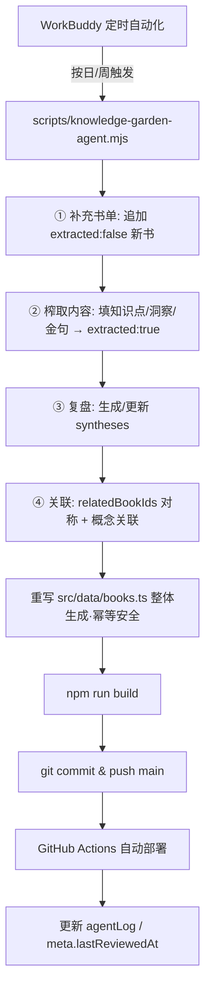
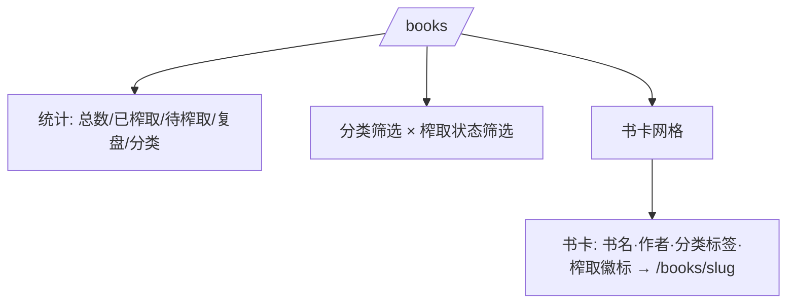
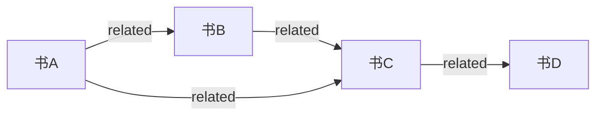

# 简单 PRD：知识花园 / 书库子系统（智识花园）

> 作者：许清楚（产品经理） · 状态：v1 草案 · 适用范围：现有 Astro 6 静态站点**增强**，新增「书库」子系统，非重建、不替换既有页面

---

## 0. 项目信息

- **Language**：中文
- **技术栈（约束内）**：Astro 6（`output:'static'`）+ Tailwind CSS 4 + TypeScript；复用既有依赖（Fuse.js / marked 按需），**不新增运行时依赖**（关联图谱优先零依赖手绘 SVG + 轻量力导向；确需库时必须先陈述理由）。
- **Project Name**：`knowledge_garden_books`（仓库：`lystrosaurus.github.io`）
- **部署现状**：GitHub Pages + GitHub Actions（`push` 到 `main` 自动 `astro build` → 部署）。`npm run build` 即 `astro build`。
- **原始需求复述**：在现有纯静态站点中新增以「书」为核心、Agent 驱动的「知识花园 / 书库」子系统，把用户文档里那套 vanilla-JS SPA「智识花园」方案**适配进 Astro 仓库**（不是替换成独立 SPA）。包含：① 类型化数据层 `src/data/books.ts`；② 5 个展示页（`/books`、`/books/[slug]`、`/syntheses`、`/garden/graph`、`/garden/agent`）；③ 可移植 Node agent runner（`scripts/knowledge-garden-agent.mjs`）；④ WorkBuddy 定时自动化调度其四步周期。保持纯静态、无后端，视觉与站点其余青紫科技风**隔离**（独立棕金衬线风）。

> ⚠️ 说明：本 PRD 依据任务中转述的《数据规格说明.md》《设计实现方案文档.md》「智识花园」方案撰写；参考源文档未随仓库提供，凡涉及「21 本书具体书名/作者/年份」「2–3 本完整榨取示例书的内容」等需逐条填充的数据，列为 §8 待确认项，交付前由用户/文档补齐。

---

## 1. 产品目标（正交三目标）

- **G1 内容沉淀**：让用户与 Agent 以结构化方式沉淀「书 → 知识点（基础/进阶/心法）→ 可行动洞察 → 金句 → 跨书复盘」，把读过的书变成可检索、可关联的知识资产。
- **G2 自动进化**：通过可移植、幂等的 Agent runner + 定时自动化，让书库持续「补充书单 → 榨取内容 → 复盘 → 关联」，在无后端前提下自我生长，且**绝不静默丢失既有数据**。
- **G3 沉浸阅读体验**：以独立「暗色文明」棕金衬线视觉呈现书库，与站点其余科技风视觉隔离；提供总览、详情、复盘、关联图谱、Agent 看板五种视角，降低知识浏览与发现成本。

---

## 2. 用户故事

- 作为**访客**，我希望打开 `/books` 看到总览统计与书卡网格，并按分类 / 榨取状态筛选，以便快速定位想读或已榨取的书。
- 作为**读者**，我希望点开一本书看到核心命题（引用块）、分级知识点（基础/进阶/心法）、可行动洞察、金句与关联书目，以便吸收书中精华。
- 作为**探索者**，我希望在 `/garden/graph` 看到书与书的关联网络、点击节点跳详情，以便发现跨书主题脉络。
- 作为**站点主人**，我希望 `/syntheses` 列出跨书复盘、`/garden/agent` 展示 Agent 最近运行日志与各项计数，以便了解知识花园的演化与健康状况。
- 作为**维护者（Agent）**，我希望有一个可重复执行的 Node runner 能对未榨取的书补充知识点、生成复盘、修正关联，并安全提交部署，以便书库持续更新。

---

## 3. 数据模型（严格对齐《数据规格说明.md》）

> 单一真相源是类型化 TS 模块 `src/data/books.ts`，导出类型与数组，Agent 可程序化追加/更新。

```ts
type Category = {
  id: string;
  name: string;
  icon: string;   // 建议 emoji，待 §8 确认
  desc: string;
};

type KnowledgePoint = {
  concept: string;
  detail: string;
  level: '基础' | '进阶' | '心法';
};

type Book = {
  id: string;            // URL-safe，用作 slug 与关联键
  title: string;
  author: string;
  category: Category['id'];
  year: number;
  accent: string;        // hex，如 '#c9954a'，用于节点/书卡强调色（内联 style）
  summary: string;
  coreThesis: string;    // 核心命题（详情页引用块）
  knowledgePoints: KnowledgePoint[];
  actionable: string[];  // 可行动洞察
  quotes: string[];      // 金句
  relatedBookIds: string[]; // 关联书目（必须对称、指向已存在 id）
  extracted: boolean;    // 是否已榨取
  extractedAt: string | null; // 'YYYY-MM-DD HH:mm'
};

type Synthesis = {
  id: string;
  title: string;
  theme: string;
  bookIds: string[];     // 必须指向已存在 book id
  summary: string;
  points: string[];
};

type LogEntry = {
  time: string;          // 'YYYY-MM-DD HH:mm'
  action: string;
  detail: string;
};

type GardenMeta = {
  generatedAt: string;   // 'YYYY-MM-DD HH:mm'
  lastReviewedAt: string | null;
  agentVersion: string;  // 语义版本，如 '1.0.0'
  bookCount: number;     // 必须 === books.length
  note?: string;
};

// 顶层导出（具名导出，供页面与 agent 复用）
export const categories: Category[] = [/* 8 项 */];
export const books: Book[] = [/* 21 目录 + 2–3 完整示例 */];
export const syntheses: Synthesis[] = [/* 初始可为空或 1–2 条示例 */];
export const agentLog: LogEntry[] = [];
export const meta: GardenMeta = {/* ... */};
```

**引用完整性（编译期/运行期校验）**
- 每个 `relatedBookIds`、`syntheses.bookIds` 必须指向已存在的 `book.id`。
- `meta.bookCount === books.length`。
- `Book.category` 必须存在于 `categories.id`。
- 建议：在 `books.ts` 末尾或独立 `scripts/validate-books.mjs` 中做启动校验，CI/构建期失败即报错。

**8 分类名单（来自文档，id → name）**
`thinking` 思维与认知 / `habits` 习惯与效能 / `wealth` 财富与投资 / `psychology` 心理与行为 / `comm` 沟通与表达 / `ai` AI与未来 / `classic` 东方智慧 / `bio` 传记与思维史

**种子数据**
- 21 本书（8 分类）建成目录条目：`extracted:false`、`knowledgePoints/actionable/quotes` 留空或占位、`extractedAt:null`、`relatedBookIds:[]`。
- 另内置 **2–3 本完整榨取示例书**（含真实 `knowledgePoints`/`actionable`/`quotes` + 若干 `relatedBookIds`），使页面开箱即有内容。
- （具体书名/作者/年份/示例书内容见 §8 待确认，依赖《数据规格说明.md》§9 书籍清单。）

---

## 4. 关键约束（强制，务必遵守）

1. **纯静态、无后端**：所有数据来自构建期 `src/data/books.ts`，页面为静态生成；不引入服务端/数据库。
2. **XSS 安全**：任何 `innerHTML` 注入内容**必须经过 `escapeHtml`**（复用 `src/utils/dom.ts`，签名 `escapeHtml(s: string): string`）；书卡/详情等用户可能编辑或 Agent 写入的字段一律转义。
3. **Tailwind 4 动态颜色**：动态色（如 `book.accent`）**必须用内联 `style="color:#xxx"` / `style="background:#xxx"` 写 hex**；**严禁** `text-${x}` / `bg-${x}` 这类运行时拼接工具类（Tailwind 4 不生成动态类）。
4. **视觉隔离**：书库使用独立「暗色文明」棕金衬线风，色板（取自 DESIGN.md §4）：
   - 底色 `#0f0e0c`、卡片 `#221f1b`、主文字 `#e8e0d4`、主题色/金 `#c9954a`、边框 `#3a3530`、次级文字 `#a39888`
   - 字体：`Georgia` / `Noto Serif SC` 衬线体
   - 实现：独立样式文件 `src/styles/garden.css`（仅书库页 `<link>`/import 引入）或页面级 scoped `<style>`，**不得污染全局青紫主题**。
5. **不新增重依赖**：图谱、筛选、看板均优先零依赖实现；确需库须先陈述理由并经确认（见 §8）。
6. **Header 集成**：在 `src/components/Header.astro` 的 `navItems` 数组新增「书库」项（图标 📖 + 文案「书库」，`href:'/books'`），桌面与移动菜单均生效，风格与现有导航一致（激活态高亮）。
7. **Agent 幂等 & 安全**：`scripts/knowledge-garden-agent.mjs` 必须**幂等**——重复运行结果稳定；**绝不静默删除既有数据**（只追加/更新已存在条目字段，不 truncate、不随机删行）。

---

## 5. 需求池

> **P0 = 数据模型 + 5 个展示页 + agent runner + 自动化 + Header 集成**，界定为 MVP 必交付。
> （说明：「5 个展示页」= `/books`、`/books/[slug]`、`/syntheses`、`/garden/graph`、`/garden/agent`；其中 `/garden/agent` 与 agent runner 同属「Agent 能力簇」。）

### P0（必须，MVP）

**P0-数据-1 类型化数据层 `src/data/books.ts` + 种子数据**
- 实现 §3 全部类型与具名导出（`categories`/`books`/`syntheses`/`agentLog`/`meta`）。
- 内置 8 分类 + 21 本 `extracted:false` 目录条目 + 2–3 本完整榨取示例书（字段真实可用）。
- 附引用完整性校验（构建期或独立脚本），失败即报错。
- 验收：页面可静态读取并渲染；`meta.bookCount === books.length`；`relatedBookIds`/`bookIds` 均指向存在 id。

**P0-展示-1 `/books` 总览**
- 顶部统计：总数 / 已榨取 / 待榨取 / 复盘数 / 分类数。
- 书卡网格：每卡展示书名、作者、分类标签（内联 hex 色）、榨取状态徽标；点击跳 `/books/[slug]`。
- 筛选：分类筛选（8 类）+ 榨取状态筛选（全部 / 已榨取 / 待榨取），纯前端切换（客户端 `<script>`，数据经 `escapeHtml` 后注入）。
- 验收：统计数字正确；筛选实时生效；卡片动效与全站一致。

**P0-展示-2 `/books/[slug]` 书籍详情**
- 头部：书名 / 作者 / 分类 / 年份（强调色用 `book.accent` 内联 hex）。
- 核心命题：`coreThesis` 以引用块（blockquote）呈现。
- 知识点：按 `基础 / 进阶 / 心法` 三级分组，各级带**色标签**（三级颜色用内联 hex 区分）。
- 可行动洞察（`actionable` 列表）、金句（`quotes` 列表，引用样式）。
- 关联书目：渲染 `relatedBookIds` 对应书卡，点击跳对应详情。
- 验收：分级清晰、色标签可读；关联卡可跳转；空字段优雅降级（如「待榨取」提示）。

**P0-展示-3 `/syntheses` 跨书复盘列表**
- 卡片：标题 + 主题 + 书名标签（可点跳 `/books/[slug]`）+ 概述 + 要点列表。
- 空态：当 `syntheses` 为空时显示「尚未生成复盘」引导文案。
- 验收：书名标签可点；要点渲染正确。

**P0-展示-4 `/garden/graph` 关联图谱**
- 节点 = 书（`relatedBookIds` 为边；可选共享概念为边，见 P2）。
- 节点颜色 = `book.accent`（内联 hex），标签显示书名（经 `escapeHtml`）。
- 布局：零依赖手绘 SVG + 轻量力导向（客户端 `<script>` 计算坐标）或预计算静态坐标；节点可点击跳 `/books/[slug]`。
- 可读性：边不过密、标签不重叠（力导向带碰撞半径）；提供 hover 高亮相邻节点。
- 验收：节点可点跳转；图谱清晰可读；大数据量（21+ 节点）不崩。

**P0-展示-5 `/garden/agent` Agent 看板（只读）**
- 展示最新 `agentLog` 若干条（时间/动作/详情）、`lastReviewedAt`、`meta` 各项计数（bookCount、已榨取数、syntheses 数、categories 数）、`agentVersion`。
- 纯静态只读看板；**真实运行由 Node runner / 自动化执行**，本页不触发任何写操作。
- 验收：数据来自 `books.ts`；无写操作；视觉与书库一致。

**P0-Agent-1 `scripts/knowledge-garden-agent.mjs`（可移植 Node runner）**
- 编辑 `src/data/books.ts` → `npm run build` → 提交并推送（由现有 GitHub Actions 部署）。
- 四步周期：
  ① **补充书单**：按策略向 `books` 追加新条目（`extracted:false`）；
  ② **榨取内容**：对 `extracted:false` 的书填充 `knowledgePoints/actionable/quotes`，置 `extracted:true`、`extractedAt`；
  ③ **复盘**：生成 / 更新 `syntheses`（跨书 `bookIds` + `summary` + `points`）；
  ④ **关联**：保证 `relatedBookIds` **对称**（A→B 则 B→A）+ 概念关联，写 `agentLog` 与更新 `meta`（`lastReviewedAt`/`generatedAt`/`agentVersion`）。
- **幂等 & 安全**：内存模型为唯一真相，整体重生成 `books.ts`（保留文件头注释与类型导出），只追加/更新已存在条目，绝不静默删除；失败不写库、不改提交。
- 验收：连跑两次结果一致；既有条目不被删；推送触发 Actions 部署成功。

**P0-Agent-2 WorkBuddy 定时自动化调度（日/周）**
- 用 WorkBuddy 定时自动化按 **日 / 周** 调度 `scripts/knowledge-garden-agent.mjs` 四步周期（建议：补充+榨取按日，复盘+关联按周，具体节奏见 §8）。
- 调度器只负责「在约定时间运行 runner」，不取代现有 GitHub Actions 部署。
- 验收：在约定时间自动触发 runner；运行记录可追溯。

**P0-集成-1 Header 导航新增「书库」**
- 在 `src/components/Header.astro` `navItems` 增加 `{ href:'/books', label:'书库', icon:'📖' }`，桌面与移动菜单均生效，激活态高亮风格一致。
- 验收：任意页可见「书库」入口；当前在 `/books*` 下高亮。

### P1（应有，非阻塞）

- **P1-笔记-1 笔记引用书**：`/notes` 笔记可引用 `book id` 形成关联（笔记模型新增可选 `relatedBookIds: string[]` 或 `bookId?`）；笔记卡片展示关联书链接。
- **P1-搜索-1 搜索纳入书名**：`/search` 构建期索引可纳入 `books` 书名/作者/摘要，复用既有 Fuse.js 索引构建方式。

### P2（可选）

- **P2-图谱-1 概念边**：图谱除 `relatedBookIds` 边外，增加「共享概念」边（同 `concept` 的书相连），可切换显示。
- **P2-备份-1 数据快照**：提供导出 `books.ts` / 生成 JSON 快照的能力（便于备份与回滚）。
- **P2-看板-2 榨取进度**：Agent 看板增加「待榨取队列」「下次计划」等进度可视化。

---

## 6. 关键流程：Agent 四步周期



---

## 7. UI 设计稿

### 7.1 站点导航（Header 集成）
```
┌──────────────────────────────────────────────────────────────────┐
│ L  Lystrosaurus   首页 博客 知识库 工具 笔记 📖书库   [🔍 搜索 ⌘K] │
└──────────────────────────────────────────────────────────────────┘
   书库页使用独立棕金衬线风，不继承青紫科技主题
```

### 7.2 `/books` 总览

```
# 智识花园 · 书库
[ 总数 23 ] [ 已榨取 3 ] [ 待榨取 20 ] [ 复盘 1 ] [ 分类 8 ]
[全部分类][思维][习惯][财富]…  [全部][已榨取][待榨取]
──────────────────────────────────────────────
┌────────────┐ ┌────────────┐ ┌────────────┐
│ 书名        │ │ 书名        │ │ 书名        │
│ 作者 · 2021 │ │ 作者 · 2019 │ │ 作者 · 2020 │
│ #思维  ✓已榨 │ │ #财富  ⏳待榨│ │ #习惯  ⏳待榨│
└────────────┘ └────────────┘ └────────────┘
  (棕金衬线风，accent 内联 hex)
```

### 7.3 `/books/[slug]` 详情
```
# 书名                                   [关联书目 →]
作者 · 分类 · 年份
──────────────────────────────────────
▌ 核心命题
  “coreThesis 引用块”

▌ 知识点
  [基础] concept — detail
  [进阶] concept — detail
  [心法] concept — detail

▌ 可行动洞察
  • actionable 1
  • actionable 2

▌ 金句
  “quote 1”
  “quote 2”

▌ 关联书目
  [书A卡] [书B卡]  → 点击跳 /books/[slug]
```

### 7.4 `/syntheses` 复盘列表
```
# 跨书复盘
┌──────────────────────────────────────┐
│ 标题           主题: 主题名            │
│ 🏷 书名A 🏷 书名B 🏷 书名C           │
│ summary 概述…                        │
│ • points[0]  • points[1]             │
└──────────────────────────────────────┘
```

### 7.5 `/garden/graph` 关联图谱

```
        (SVG 力导向, 节点=书, 边=relatedBookIds)
         ● 书A ──── 书B ●
          \        /
           ● 书C ──● 书D
        节点色=book.accent(内联hex) 点击→/books/slug hover高亮相邻
```

### 7.6 `/garden/agent` 看板（只读）
```
# Agent 状态
agentVersion 1.0.0 · lastReviewedAt 2026-07-26 09:00
[书 23] [已榨取 3] [复盘 1] [分类 8]
──── 最近运行 ────
2026-07-26 09:00  榨取   补充《X》知识点
2026-07-25 09:00  复盘   生成 synthesis-001
（纯静态只读，真实运行由 runner/自动化执行）
```

---

## 8. 待确认问题（需用户拍板的开放点）

1. **21 本书具体清单**：《数据规格说明.md》§9 的 21 本书「书名 / 作者 / 年份 / 所属分类」需补齐，用于种子 `extracted:false` 目录。→ 请提供清单，或由 PM 按 8 分类先铺占位、后续填充。
2. **2–3 本完整榨取示例书**：选定哪几本作为开箱即有的完整内容（含真实 `knowledgePoints`/`actionable`/`quotes` 与若干 `relatedBookIds`）？→ 需书名 + 示例内容（或授权 Agent 在首次运行时榨取）。
3. **分类 `icon` 与 `desc`**：8 分类仅给了 id/name，缺 `icon`（建议 emoji，如 🧠/⚙️/💰…）与 `desc` 文案。→ 确认图标方案（emoji vs SVG）并补全描述。
4. **Agent 编辑 TS 的安全策略**：runner 改写 `books.ts` 推荐采用「内存模型为唯一真相 → 整体重生成文件（保留头注释/类型导出）」，天然幂等且不删数据。→ 确认此策略；或指定其他补丁方式（如结构化标记区间替换）。
5. **图谱实现选型**：零依赖手绘 SVG + 轻量力导向（推荐，无新增依赖）vs 引入 `d3-force` 等轻量库。→ 选零依赖还是许可依赖（需陈述理由）。
6. **书 slug 策略**：推荐 `slug === book.id`（与 `relatedBookIds` 直接对应，避免标题 slug 漂移）。→ 确认；或改用标题派生 slug（需额外映射表）。
7. **自动化节奏**：四步周期如何分配日/周？→ 建议「补充+榨取=每日，复盘+关联=每周」；或全每日。请定档。
8. **推送权限与防循环**：runner 需 `git commit & push main` 的写权限（WorkBuddy 自动化上下文 / bot token）；且 push 只触发部署 Actions、**不回触发 agent**，避免无限循环。→ 确认凭据与触发边界。
9. **P1 笔记↔书关联数据形态**：`/notes` 笔记如何引用书？→ 在笔记模型新增 `relatedBookIds: string[]`（推荐）或 `bookId?`；确认字段与 UI 呈现。
10. **P1 搜索纳入书名的接入点**：`/search` 构建期索引需读取 `books.ts`，扩展现有静态元数据数组。→ 确认在搜索索引构建处接入（不影响既有 blog/wiki/tools 索引）。
