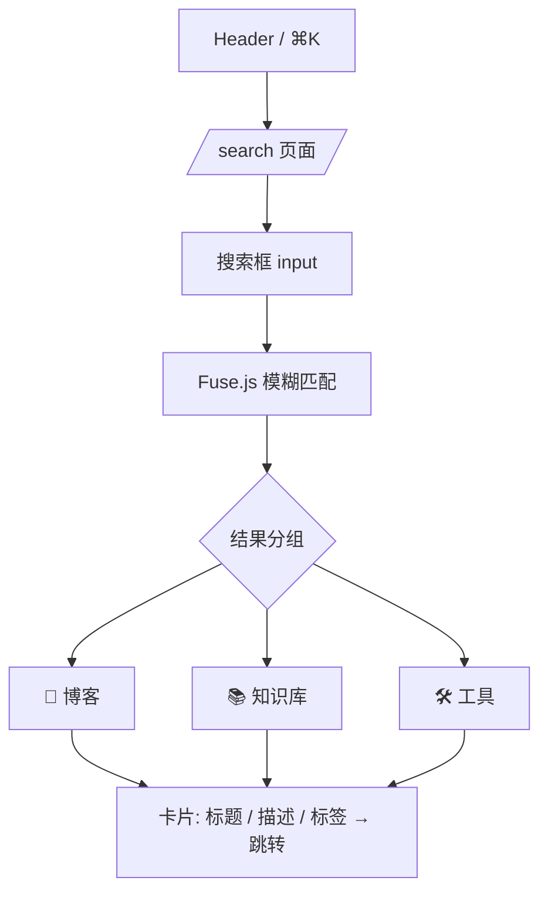
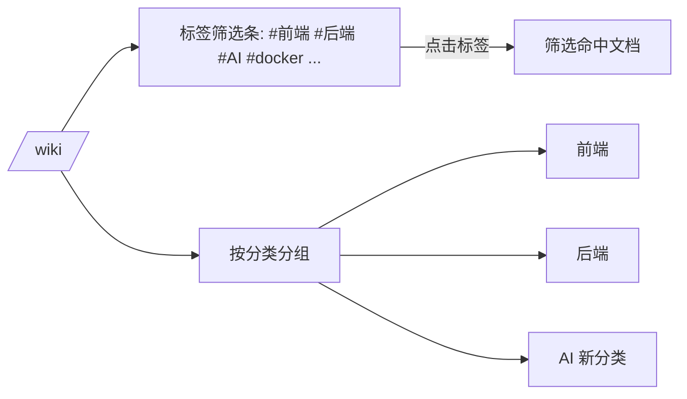
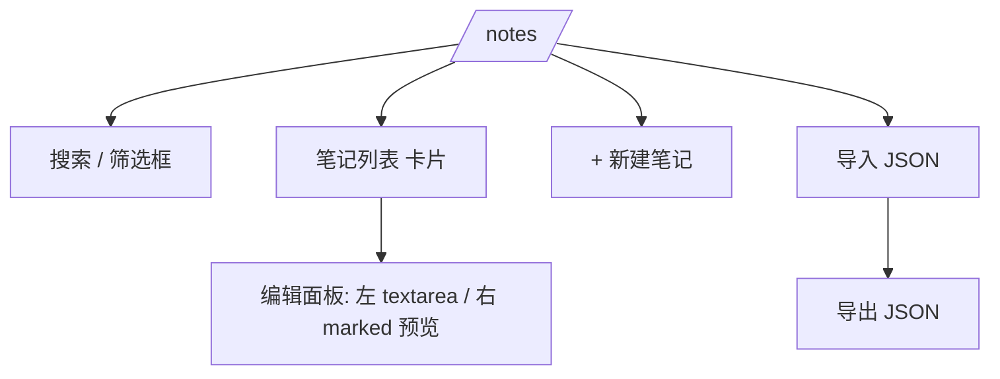

# 简单 PRD：Lystrosaurus 个人知识管理系统增强

> 作者：许清楚（产品经理） · 状态：v1 草案 · 适用范围：现有静态站点（Astro 6 + GitHub Pages）增强，非重建

## 1. 项目信息
- **Language**：中文
- **技术栈（约束内）**：Astro 6（`output:'static'`）+ Tailwind CSS 4 + Fuse.js + marked（均为既有依赖，**不新增运行时依赖**）
- **Project Name**：`knowledge_management_hub`（仓库：`lystrosaurus.github.io`）
- **原始需求复述**：在现有纯静态个人站点基础上，增强为「个人知识管理系统」，新增三大能力——① 笔记管理 ② 知识分类 ③ 内容检索；保持纯静态、无后端、无数据库，笔记数据 `localStorage` 持久化；复用既有设计系统与依赖；视觉风格可调整但须延续现有深色「科技」美学。

## 2. 产品目标
- 让用户在浏览器内**零依赖地管理个人笔记**（创建/编辑/删除/标签/Markdown 预览/导入导出），数据本地持久化，换设备靠 JSON 备份。
- 让知识库（wiki）具备**动态分类与标签筛选**，移除现有硬编码分类色板，支撑内容自然增长而无需改代码。
- 提供**全局搜索**（博客 + 知识库 + 工具），并在 Header 常驻入口与 `⌘K` 快捷唤起，降低信息查找成本。
- 在保持纯静态前提下，**加固 GitHub Actions 部署流水线**（版本锁定、可复现、可审计），保障稳定发布。
- 新模块无缝融入现有设计系统（复用 token 与 `.glass-card` / `.input-field` / `.neon-text` 等工具类）。

## 3. 用户故事
- 作为**访客**，我希望在站顶搜索框输入关键词或按 `⌘K` 唤起搜索，以便快速定位博客 / 知识库 / 工具内容。
- 作为**读者**，我希望在知识库按分类分组、按标签筛选，以便聚焦我关心的主题。
- 作为**站点主人**，我希望在浏览器里写笔记、打标签、用 Markdown 编辑并实时预览，以便沉淀零散想法。
- 作为**站点主人**，我希望笔记可在本机导入 / 导出 JSON，以便在换设备或备份时不丢失。
- 作为**维护者**，我希望 CI 部署流水线被加固（Action 版本锁定、可复现、失败可排查），以便每次 push 都能稳定上线。

## 4. 需求池

### P0（必须，MVP）
**P0-检索-1 全局搜索页 `/search`**
- 构建期在 `/search` 页面生成全站搜索索引（blog + wiki + tools 静态元数据数组），字段：`{type, title, description, tags, category, url}`。
- 使用 Fuse.js（已安装）做模糊检索；结果按 `type` 分组展示。
- 每条结果展示标题、类型徽标、描述、标签；命中可点击跳转。
- 验收：输入 `docker` 能召回 `docker-cheatsheet` 等知识库条目与相关工具；空查询展示全部 / 热门。

**P0-检索-2 Header 搜索入口 + `⌘K`**
- 在 Header 右侧新增常驻搜索输入框（移动端折叠为搜索图标）；点击 / 聚焦或按 `⌘K`/`Ctrl+K` 唤起搜索（v1 直达 `/search`）。
- 复用 `.input-field` / `.glass-card` 视觉。
- 验收：任意页面按 `⌘K` 可唤起；移动端图标可点。

**P0-分类-1 知识库动态分类 + 标签筛选**
- 移除 `wiki/index.astro` 中硬编码 `categoryColors` 映射（仅 前端 / 后端 / 工具）。
- 改为按实际 `category` 动态分组；分类色由「名称哈希 → 固定调色板循环」算法生成，覆盖任意新增分类（如 `AI`）。
- 新增标签筛选条：点击标签高亮并筛选（P0 至少支持「全站按标签筛选」wiki 条目）。
- 验收：新增任意 `category` 无需改代码即显示；点标签过滤正确。

**P0-笔记-1 `/notes` 笔记管理（localStorage）**
- 新增 `/notes` 页面（复用 `BaseLayout` / `ToolLayout`）。
- 数据模型：`{id, title, content(markdown), tags[], createdAt, updatedAt, pinned?}`。
- 能力：新建、编辑（标题 + 正文 `textarea`）、删除、列表展示（卡片含标题 / 标签 / 更新时间）。
- 持久化：`localStorage` key 如 `km_notes`（复用 `todo.astro` 的 load/save/render 模式；**安全**：标题 / 标签渲染前 `escapeHtml`，正文经 `marked` 渲染）。
- Markdown 实时预览（左编辑右预览，`marked` 已装）。
- 验收：刷新后笔记仍在；删除有确认；列表正确渲染。

**P0-笔记-2 笔记内搜索 + JSON 导入 / 导出**
- `/notes` 顶部搜索框，按标题 / 正文 / 标签过滤当前笔记。
- 导出：全部笔记序列化为 JSON 文件下载；导入：读取 JSON 合并 / 覆盖（P0 采用「按 id upsert，导入为准」策略，见 Open Questions）。
- 验收：导出文件可再导入还原。

**P0-部署-1 加固 `deploy.yml`**
- 锁定主第三方 Action 至 commit SHA（`checkout@v4`、`setup-node@v4`、`upload-pages-artifact@v3`、`deploy-pages@v4` 改为对应 SHA），降低供应链风险（其余可保留 major tag）。
- 保留 `concurrency.group: pages`（已具备）与 `cache: npm`（已具备）。
- 增强可观测性：Build 步骤后打印 Astro 版本与 `dist` 产物体积；确认 `.nojekyll` 存在（已存在）。
- 演练：在分支 / `workflow_dispatch` 验证一次部署成功。
- 验收：workflow 在 Node 24 下通过；pinned actions 无 Dependabot 警告。

### P1（应有）
- **P1-分类-1** 知识库标签云（复用既有 `TagCloud.astro`，接入 wiki `tags` 聚合）。
- **P1-笔记-1** 笔记置顶 / 星标（`pinned` 字段 + 排序优先）。
- **P1-笔记-2** Markdown 编辑体验增强（工具栏：加粗 / 标题 / 代码块插入，仍基于 `textarea`+`marked`）。
- **P1-检索-1** 搜索结果摘要 + 关键词高亮（Fuse.js `includeMatches` 高亮片段）。
- **P1-检索-2** 搜索支持按类型过滤（博客 / 知识库 / 工具 Tab）。

### P2（可选）
- **P2-笔记-1** 笔记间双向链接 `[[笔记名]]`，解析为可点击跳转。
- **P2-笔记-2** 笔记关系图谱（力导向图，纯前端 SVG / canvas，无依赖或极小依赖）。
- **P2-笔记-3** 每日笔记（daily notes，按日期自动建页）。
- **P2-笔记-4** 笔记导出为仓库内 MDX（生成 frontmatter + body，供用户手动提 PR）。
- **P2-检索-1** 全文索引离线缓存（Service Worker 预缓存搜索数据）。

## 5. UI/UX 草图

### 5.1 Header（新增搜索入口）
```
┌──────────────────────────────────────────────────────────────┐
│ L  Lystrosaurus   首页 博客 知识库 工具   [ 🔍 搜索…  ⌘K ]     │
└──────────────────────────────────────────────────────────────┘
   移动端：显示 🔍 图标，点击展开搜索
```
说明：搜索框右侧常驻；聚焦 / `⌘K` 触发搜索（v1 跳转 `/search`）。

### 5.2 `/search` 全局搜索

```
搜索: "docker"                          [全部][博客][知识库][工具]
─────────────────────────────────────────────────────
📚 知识库
  ▸ Docker 速查表         #docker #container     → /wiki/docker-cheatsheet
🛠 工具
  ▸ 正则测试器            #regex                 → /tools/regex-tester
```

### 5.3 增强版 `/wiki`（分类 + 标签筛选）

```
# 知识库                           系统性的笔记与速查手册
[ 全部 ] #前端 #后端 #AI #docker #git #react ...
── 前端 ──────────────────────────   (颜色由名称哈希自动分配)
  [CSS Grid] [React Hooks] [VSCode 快捷键]
── 后端 ──────────────────────────
  [Docker 速查表] [Git 工作流] [SQL 基础]
── AI ────────────────────────────   (新增分类无需改代码)
  [自进化 Agent 引擎]
```

### 5.4 `/notes` 笔记管理

```
# 笔记                         [🔍 搜索] [+ 新建] [⬇ 导出] [⬆ 导入]
──────────────────────  ┌──────────────────────────────┐
📌 架构思考             │  标题: [__________]          │
   #架构 #ai  2025-07   │  标签: [__________]          │
📄 读书摘抄             │  ┌────────┐ ┌─────────────┐ │
   #阅读                │  │ 编辑   │ │ 预览(marked)│ │
                      │  │textarea│ │ 渲染 HTML    │ │
                      │  └────────┘ └─────────────┘ │
                      │  [保存] [删除]               │
                      └──────────────────────────────┘
```

## 6. 待确认问题与假设
1. **笔记作用域**：localStorage 按浏览器 / 设备隔离，不跨设备同步。假设：v1 仅本机持久化，跨设备靠 JSON 导入导出。✅ 推荐采用。
2. **Header 搜索形态**：A）常驻输入框 + `⌘K` 跳转 `/search`；B）仅 `⌘K` 弹层就地搜索。假设：采用 A（更可见、移动端友好）。✅ 推荐。
3. **搜索数据来源**：静态生成索引（构建期注入 `/search`）。blog / wiki 用 `getCollection` 汇总；tools 用静态元数据数组（7 个工具写死）。✅ 推荐，零运行时依赖。
4. **标签筛选范围**：P0 做「全站标签筛选」（点击标签展示所有命中 wiki 条目），分类分组保留。✅ 推荐。
5. **笔记导入策略**：覆盖 or 合并？假设：导入时按 `id` upsert，重复 `id` 以导入文件为准。✅ 推荐。
6. **笔记是否导出为仓库 MDX**：P2 能力。假设：P0 仅 JSON 导入导出；导出 MDX 留 P2 由用户手动提 PR。⚠️ 待用户确认是否需在 P0 提供。
7. **分类色算法**：用 `category` 名称哈希映射到固定调色板（cyan / purple / pink / …），稳定且覆盖任意新分类。✅ 推荐（替代硬编码）。
8. **新增依赖**：严格不引入运行时新依赖；Markdown 编辑器用原生 `textarea`+`marked`。仅当富文本需求强烈时再评估（P1 工具栏仍基于 `textarea`）。✅ 推荐零新增依赖。
9. **搜索是否覆盖笔记**：笔记在 localStorage，构建期不可知，故全局搜索 P0 仅覆盖 blog / wiki / tools；笔记内搜索在 `/notes` 独立进行。✅ 推荐。
10. **部署加固力度**：是否要求 SHA-pin 所有 Action？假设：P0 至少 pin 主 Action 至 SHA（供应链安全），其余保留 major tag。✅ 推荐。
