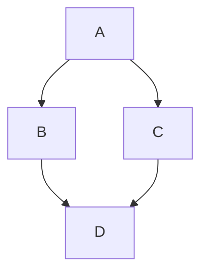
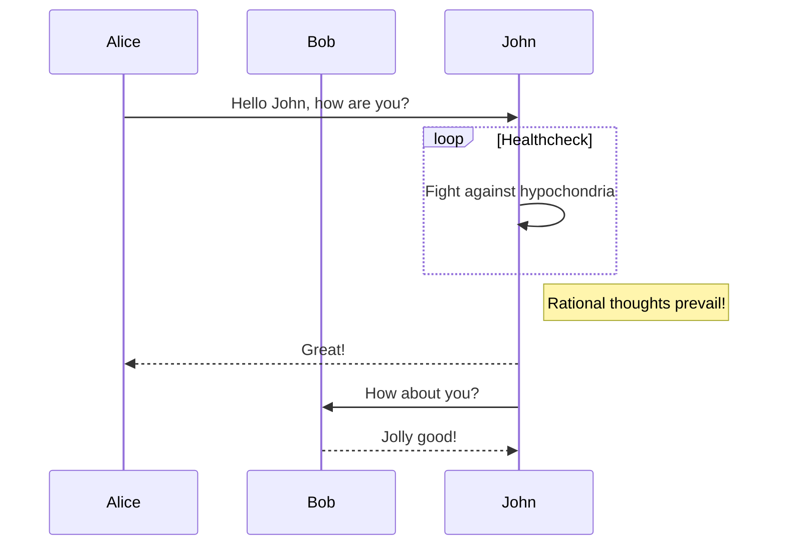
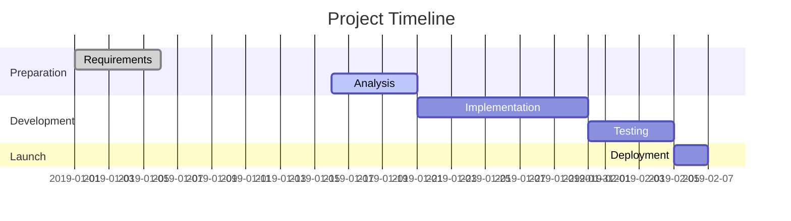
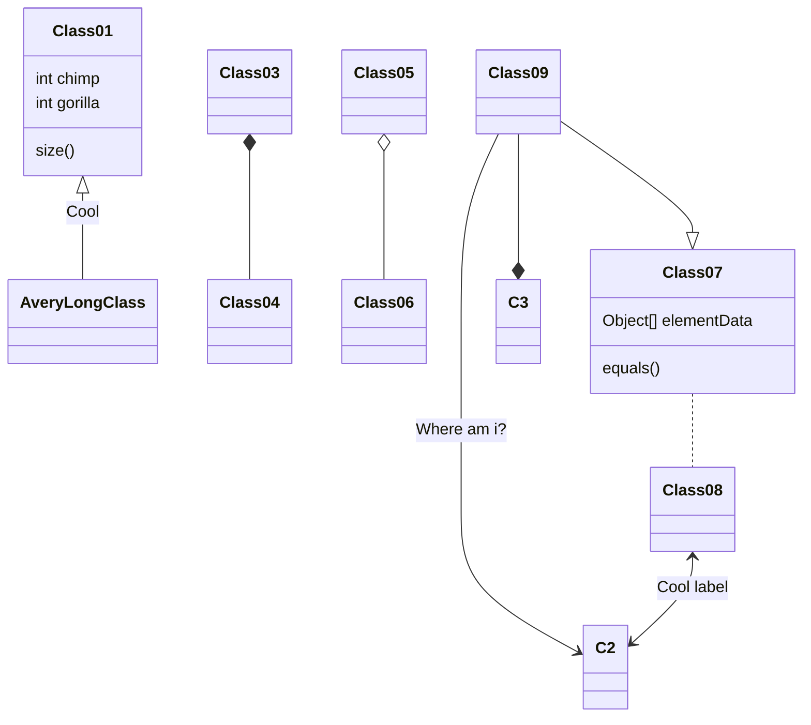

# Personal Site Redesign Implementation Plan

> **For agentic workers:** REQUIRED SUB-SKILL: Use superpowers:subagent-driven-development (recommended) or superpowers:executing-plans to implement this plan task-by-task. Steps use checkbox (`- [ ]`) syntax for tracking.

**Goal:** Rebuild the Hexo blog into a modern personal site with homepage, blog, wiki, and developer tools using Astro + Tailwind CSS.

**Architecture:** Static site built with Astro 4.x, styled with Tailwind CSS in dark theme, content managed via Astro Content Collections (MDX), tools are client-side interactive components.

**Tech Stack:** Astro 4.x, Tailwind CSS, MDX, Shiki (code highlighting), Fuse.js (search), GitHub Actions (deployment)

---

## File Structure

```
lystrosaurus.github.io/
├── .github/workflows/deploy.yml    # GitHub Actions deployment
├── astro.config.mjs                 # Astro configuration
├── tailwind.config.mjs              # Tailwind CSS configuration
├── package.json                     # Dependencies
├── tsconfig.json                    # TypeScript config
├── public/                          # Static assets
│   ├── avatar.png                   # Personal avatar
│   └── favicon.svg                  # Site favicon
├── src/
│   ├── content/
│   │   ├── config.ts               # Content Collections schema
│   │   ├── blog/                   # Blog posts (MDX)
│   │   └── wiki/                   # Wiki entries (MDX)
│   ├── layouts/
│   │   ├── BaseLayout.astro        # Base HTML layout
│   │   ├── PostLayout.astro        # Blog/Wiki post layout
│   │   └── ToolLayout.astro        # Tool page layout
│   ├── components/
│   │   ├── Header.astro            # Navigation header
│   │   ├── Footer.astro            # Site footer
│   │   ├── Card.astro              # Reusable card component
│   │   ├── TagCloud.astro          # Skills/Tags display
│   │   ├── SearchBar.astro         # Search input
│   │   └── ToolCard.astro          # Tool list card
│   ├── pages/
│   │   ├── index.astro             # Homepage
│   │   ├── blog/
│   │   │   ├── index.astro         # Blog list
│   │   │   └── [slug].astro        # Blog post detail
│   │   ├── wiki/
│   │   │   ├── index.astro         # Wiki list
│   │   │   └── [slug].astro        # Wiki entry detail
│   │   └── tools/
│   │       ├── index.astro         # Tools list
│   │       ├── json.astro          # JSON formatter
│   │       ├── base64.astro        # Base64 encoder/decoder
│   │       ├── timestamp.astro     # Timestamp converter
│   │       ├── regex.astro         # Regex tester
│   │       ├── markdown.astro      # Markdown previewer
│   │       ├── pomodoro.astro      # Pomodoro timer
│   │       └── todo.astro          # Todo list
│   └── styles/
│       └── global.css              # Global styles + Tailwind imports
└── docs/
    └── superpowers/
        ├── specs/                  # Design spec
        └── plans/                  # This plan
```

---

## Task 1: Initialize Astro Project

**Files:**
- Create: `package.json`
- Create: `astro.config.mjs`
- Create: `tsconfig.json`
- Create: `tailwind.config.mjs`
- Create: `src/styles/global.css`
- Create: `public/favicon.svg`

- [ ] **Step 1: Remove old Hexo files**

```bash
# Backup docs, then remove old site files
cd C:\project\lystrosaurus.github.io
# Keep docs/ and .git/, remove everything else
Remove-Item -Recurse -Force 2019, archives, css, images, js, lib, index.html
```

- [ ] **Step 2: Create package.json**

```json
{
  "name": "lystrosaurus.github.io",
  "type": "module",
  "version": "1.0.0",
  "scripts": {
    "dev": "astro dev",
    "start": "astro dev",
    "build": "astro build",
    "preview": "astro preview"
  },
  "dependencies": {
    "astro": "^4.16.0",
    "@astrojs/mdx": "^3.1.0",
    "@astrojs/tailwind": "^5.1.0",
    "tailwindcss": "^3.4.0",
    "fuse.js": "^7.0.0",
    "marked": "^12.0.0"
  }
}
```

- [ ] **Step 3: Create astro.config.mjs**

```javascript
import { defineConfig } from 'astro/config';
import mdx from '@astrojs/mdx';
import tailwind from '@astrojs/tailwind';

export default defineConfig({
  site: 'https://lystrosaurus.github.io',
  integrations: [mdx(), tailwind()],
  output: 'static',
});
```

- [ ] **Step 4: Create tsconfig.json**

```json
{
  "extends": "astro/tsconfigs/strict",
  "compilerOptions": {
    "baseUrl": ".",
    "paths": {
      "@/*": ["src/*"]
    }
  }
}
```

- [ ] **Step 5: Create tailwind.config.mjs**

```javascript
/** @type {import('tailwindcss').Config} */
export default {
  content: ['./src/**/*.{astro,html,js,jsx,md,mdx,svelte,ts,tsx,vue}'],
  theme: {
    extend: {
      colors: {
        bg: {
          DEFAULT: '#0a0a0a',
          secondary: '#111111',
          tertiary: '#1a1a1a',
        },
        cyan: {
          DEFAULT: '#00fff2',
          dim: '#00ccc2',
        },
        purple: {
          DEFAULT: '#a855f7',
          dim: '#8b3fd4',
        },
        text: {
          primary: '#e5e5e5',
          secondary: '#a3a3a3',
          muted: '#666666',
        },
        border: {
          DEFAULT: '#262626',
          hover: '#404040',
        },
      },
      fontFamily: {
        mono: ['JetBrains Mono', 'Fira Code', 'monospace'],
      },
      boxShadow: {
        'glow-cyan': '0 0 20px rgba(0, 255, 242, 0.3)',
        'glow-purple': '0 0 20px rgba(168, 85, 247, 0.3)',
        'glow-cyan-lg': '0 0 40px rgba(0, 255, 242, 0.2)',
      },
      backdropBlur: {
        xs: '2px',
      },
      animation: {
        'typewriter': 'typewriter 3s steps(30) infinite',
        'blink': 'blink 0.7s step-end infinite',
        'glow-pulse': 'glow-pulse 2s ease-in-out infinite',
        'float': 'float 6s ease-in-out infinite',
      },
      keyframes: {
        typewriter: {
          '0%': { width: '0' },
          '50%': { width: '100%' },
          '100%': { width: '100%' },
        },
        blink: {
          '50%': { opacity: '0' },
        },
        'glow-pulse': {
          '0%, 100%': { boxShadow: '0 0 20px rgba(0, 255, 242, 0.3)' },
          '50%': { boxShadow: '0 0 40px rgba(0, 255, 242, 0.5)' },
        },
        float: {
          '0%, 100%': { transform: 'translateY(0)' },
          '50%': { transform: 'translateY(-10px)' },
        },
      },
    },
  },
  plugins: [],
};
```

- [ ] **Step 6: Create src/styles/global.css**

```css
@tailwind base;
@tailwind components;
@tailwind utilities;

@import url('https://fonts.googleapis.com/css2?family=JetBrains+Mono:wght@400;500;600;700&family=Inter:wght@400;500;600;700&display=swap');

@layer base {
  html {
    @apply bg-bg text-text-primary scroll-smooth;
    font-family: 'Inter', system-ui, -apple-system, sans-serif;
  }

  body {
    @apply min-h-screen antialiased;
  }

  ::selection {
    @apply bg-cyan/30 text-white;
  }

  ::-webkit-scrollbar {
    @apply w-2;
  }

  ::-webkit-scrollbar-track {
    @apply bg-bg-secondary;
  }

  ::-webkit-scrollbar-thumb {
    @apply bg-border rounded-full hover:bg-border-hover;
  }
}

@layer components {
  .glass-card {
    @apply bg-bg-secondary/80 backdrop-blur-md border border-border rounded-xl;
  }

  .glass-card-hover {
    @apply glass-card transition-all duration-300 hover:border-cyan/50 hover:shadow-glow-cyan hover:-translate-y-1;
  }

  .neon-text {
    @apply text-cyan;
    text-shadow: 0 0 10px rgba(0, 255, 242, 0.5), 0 0 20px rgba(0, 255, 242, 0.3);
  }

  .neon-text-purple {
    @apply text-purple;
    text-shadow: 0 0 10px rgba(168, 85, 247, 0.5), 0 0 20px rgba(168, 85, 247, 0.3);
  }

  .glow-border {
    @apply border border-cyan/30;
    box-shadow: 0 0 15px rgba(0, 255, 242, 0.1), inset 0 0 15px rgba(0, 255, 242, 0.05);
  }

  .btn-primary {
    @apply px-6 py-3 bg-cyan/10 text-cyan border border-cyan/30 rounded-lg
           hover:bg-cyan/20 hover:shadow-glow-cyan transition-all duration-300;
  }

  .btn-secondary {
    @apply px-6 py-3 bg-purple/10 text-purple border border-purple/30 rounded-lg
           hover:bg-purple/20 hover:shadow-glow-purple transition-all duration-300;
  }

  .input-field {
    @apply w-full px-4 py-3 bg-bg-tertiary border border-border rounded-lg
           text-text-primary placeholder-text-muted
           focus:outline-none focus:border-cyan/50 focus:ring-1 focus:ring-cyan/30
           transition-all duration-300;
  }
}

@layer utilities {
  .text-gradient-cyan-purple {
    @apply bg-clip-text text-transparent bg-gradient-to-r from-cyan to-purple;
  }
}
```

- [ ] **Step 7: Create public/favicon.svg**

```svg
<svg xmlns="http://www.w3.org/2000/svg" viewBox="0 0 100 100">
  <defs>
    <linearGradient id="grad" x1="0%" y1="0%" x2="100%" y2="100%">
      <stop offset="0%" style="stop-color:#00fff2;stop-opacity:1" />
      <stop offset="100%" style="stop-color:#a855f7;stop-opacity:1" />
    </linearGradient>
  </defs>
  <rect width="100" height="100" rx="20" fill="#0a0a0a"/>
  <text x="50" y="68" font-family="monospace" font-size="50" font-weight="bold" fill="url(#grad)" text-anchor="middle">F</text>
</svg>
```

- [ ] **Step 8: Create .nojekyll**

```bash
# Create empty .nojekyll file for GitHub Pages
New-Item -ItemType File -Path "C:\project\lystrosaurus.github.io\.nojekyll" -Force
```

- [ ] **Step 9: Install dependencies**

```bash
cd C:\project\lystrosaurus.github.io
npm install
```

- [ ] **Step 10: Commit**

```bash
git add -A
git commit -m "chore: initialize Astro project with Tailwind CSS"
```

---

## Task 2: Create Base Layout and Components

**Files:**
- Create: `src/layouts/BaseLayout.astro`
- Create: `src/components/Header.astro`
- Create: `src/components/Footer.astro`
- Create: `src/components/Card.astro`

- [ ] **Step 1: Create BaseLayout.astro**

```astro
---
interface Props {
  title: string;
  description?: string;
}

const { title, description = 'Fatty\'s personal website - Blog, Wiki, and Developer Tools' } = Astro.props;
---

<!DOCTYPE html>
<html lang="zh-cn">
  <head>
    <meta charset="UTF-8" />
    <meta name="viewport" content="width=device-width, initial-scale=1.0" />
    <meta name="description" content={description} />
    <link rel="icon" type="image/svg+xml" href="/favicon.svg" />
    <title>{title} | Fatty</title>
  </head>
  <body class="min-h-screen bg-bg">
    <Header />
    <main class="pt-16">
      <slot />
    </main>
    <Footer />
  </body>
</html>

<style is:global>
  @import '../styles/global.css';
</style>
```

- [ ] **Step 2: Create Header.astro**

```astro
---
const navItems = [
  { href: '/', label: '首页', icon: '🏠' },
  { href: '/blog', label: '博客', icon: '📝' },
  { href: '/wiki', label: '知识库', icon: '📚' },
  { href: '/tools', label: '工具', icon: '🛠' },
];

const currentPath = Astro.url.pathname;
---

<header class="fixed top-0 left-0 right-0 z-50 bg-bg/80 backdrop-blur-md border-b border-border">
  <nav class="max-w-6xl mx-auto px-4 h-16 flex items-center justify-between">
    <!-- Logo -->
    <a href="/" class="flex items-center gap-2 group">
      <span class="text-2xl font-bold neon-text font-mono">F</span>
      <span class="text-text-primary group-hover:text-cyan transition-colors">Fatty</span>
    </a>

    <!-- Desktop Nav -->
    <ul class="hidden md:flex items-center gap-1">
      {navItems.map((item) => (
        <li>
          <a
            href={item.href}
            class:list={[
              'px-4 py-2 rounded-lg transition-all duration-300',
              currentPath === item.href || currentPath.startsWith(item.href + '/')
                ? 'bg-cyan/10 text-cyan'
                : 'text-text-secondary hover:text-text-primary hover:bg-bg-tertiary',
            ]}
          >
            <span class="mr-1">{item.icon}</span>
            {item.label}
          </a>
        </li>
      ))}
    </ul>

    <!-- Mobile Menu Button -->
    <button
      id="mobile-menu-btn"
      class="md:hidden p-2 text-text-secondary hover:text-text-primary"
      aria-label="Toggle menu"
    >
      <svg class="w-6 h-6" fill="none" stroke="currentColor" viewBox="0 0 24 24">
        <path stroke-linecap="round" stroke-linejoin="round" stroke-width="2" d="M4 6h16M4 12h16M4 18h16" />
      </svg>
    </button>
  </nav>

  <!-- Mobile Menu -->
  <div id="mobile-menu" class="hidden md:hidden bg-bg-secondary border-b border-border">
    <ul class="px-4 py-2">
      {navItems.map((item) => (
        <li>
          <a
            href={item.href}
            class:list={[
              'block px-4 py-3 rounded-lg transition-all duration-300',
              currentPath === item.href || currentPath.startsWith(item.href + '/')
                ? 'bg-cyan/10 text-cyan'
                : 'text-text-secondary hover:text-text-primary hover:bg-bg-tertiary',
            ]}
          >
            <span class="mr-2">{item.icon}</span>
            {item.label}
          </a>
        </li>
      ))}
    </ul>
  </div>
</header>

<script>
  const btn = document.getElementById('mobile-menu-btn');
  const menu = document.getElementById('mobile-menu');

  btn?.addEventListener('click', () => {
    menu?.classList.toggle('hidden');
  });
</script>
```

- [ ] **Step 3: Create Footer.astro**

```astro
---
const year = new Date().getFullYear();
---

<footer class="mt-20 border-t border-border">
  <div class="max-w-6xl mx-auto px-4 py-8">
    <div class="flex flex-col md:flex-row items-center justify-between gap-4">
      <div class="text-text-muted text-sm">
        &copy; {year} Fatty. Built with
        <a href="https://astro.build" class="text-cyan hover:underline" target="_blank" rel="noopener">Astro</a>
        &
        <a href="https://tailwindcss.com" class="text-cyan hover:underline" target="_blank" rel="noopener">Tailwind CSS</a>
      </div>

      <div class="flex items-center gap-4">
        <a href="https://github.com/lystrosaurus" class="text-text-muted hover:text-cyan transition-colors" target="_blank" rel="noopener">
          GitHub
        </a>
      </div>
    </div>
  </div>
</footer>
```

- [ ] **Step 4: Create Card.astro**

```astro
---
interface Props {
  href?: string;
  class?: string;
  hoverable?: boolean;
}

const { href, class: className = '', hoverable = true } = Astro.props;

const Tag = href ? 'a' : 'div';
---

<Tag
  href={href}
  class:list={[
    'block p-6 rounded-xl bg-bg-secondary/80 backdrop-blur-md border border-border',
    hoverable && 'transition-all duration-300 hover:border-cyan/50 hover:shadow-glow-cyan hover:-translate-y-1',
    className,
  ]}
>
  <slot />
</Tag>
```

- [ ] **Step 5: Test the build**

```bash
cd C:\project\lystrosaurus.github.io
npm run build
```

Expected: Build succeeds (may have empty pages)

- [ ] **Step 6: Commit**

```bash
git add -A
git commit -m "feat: add base layout, header, footer, and card component"
```

---

## Task 3: Create Homepage

**Files:**
- Create: `src/pages/index.astro`
- Create: `src/components/TagCloud.astro`

- [ ] **Step 1: Create TagCloud.astro**

```astro
---
interface Props {
  tags: string[];
}

const { tags } = Astro.props;

const colors = [
  'text-cyan border-cyan/30 hover:bg-cyan/10',
  'text-purple border-purple/30 hover:bg-purple/10',
  'text-green-400 border-green-400/30 hover:bg-green-400/10',
  'text-yellow-400 border-yellow-400/30 hover:bg-yellow-400/10',
  'text-pink-400 border-pink-400/30 hover:bg-pink-400/10',
  'text-blue-400 border-blue-400/30 hover:bg-blue-400/10',
];
---

<div class="flex flex-wrap justify-center gap-3">
  {tags.map((tag, i) => (
    <span
      class:list={[
        'px-4 py-2 rounded-full border text-sm font-mono transition-all duration-300 cursor-default',
        'hover:scale-110 hover:shadow-glow-cyan',
        colors[i % colors.length],
      ]}
    >
      {tag}
    </span>
  ))}
</div>
```

- [ ] **Step 2: Create index.astro**

```astro
---
import BaseLayout from '../layouts/BaseLayout.astro';
import Card from '../components/Card.astro';
import TagCloud from '../components/TagCloud.astro';

const skills = [
  'JavaScript', 'TypeScript', 'React', 'Vue', 'Node.js',
  'Python', 'MySQL', 'Redis', 'Docker', 'Git',
  'Linux', 'Nginx', 'MongoDB', 'GraphQL', 'REST API',
];

const recentPosts = [
  {
    title: 'Hello World',
    date: '2019-10-25',
    slug: 'hello-world',
    excerpt: 'Welcome to my blog! This is my first post.',
  },
  {
    title: 'MySQL Information Schema',
    date: '2019-10-28',
    slug: 'mysql-information-schema',
    excerpt: 'Useful queries for exploring MySQL table structure.',
  },
  {
    title: 'Mermaid Diagrams',
    date: '2019-10-28',
    slug: 'mermaid-diagrams',
    excerpt: 'Examples of Mermaid diagram syntax.',
  },
];

const typeWriterTexts = [
  'Full Stack Developer',
  'Open Source Enthusiast',
  'Problem Solver',
  'Lifelong Learner',
];
---

<BaseLayout title="Home">
  <!-- Hero Section -->
  <section class="min-h-[80vh] flex items-center justify-center px-4">
    <div class="text-center max-w-3xl mx-auto">
      <!-- Avatar -->
      <div class="mb-8 relative inline-block">
        <div class="w-32 h-32 rounded-full bg-gradient-to-br from-cyan to-purple p-1 animate-glow-pulse">
          <div class="w-full h-full rounded-full bg-bg flex items-center justify-center">
            <span class="text-5xl font-bold neon-text font-mono">F</span>
          </div>
        </div>
      </div>

      <!-- Name -->
      <h1 class="text-5xl md:text-7xl font-bold mb-4">
        <span class="text-gradient-cyan-purple">Fatty</span>
      </h1>

      <!-- Typewriter Effect -->
      <div class="h-8 mb-8">
        <span id="typewriter" class="text-xl md:text-2xl text-text-secondary font-mono"></span>
        <span class="animate-blink text-cyan">|</span>
      </div>

      <!-- CTA Buttons -->
      <div class="flex flex-wrap justify-center gap-4">
        <a href="/blog" class="btn-primary">
          Read Blog
        </a>
        <a href="/tools" class="btn-secondary">
          Try Tools
        </a>
      </div>
    </div>
  </section>

  <!-- Skills Section -->
  <section class="py-20 px-4">
    <div class="max-w-4xl mx-auto">
      <h2 class="text-3xl font-bold text-center mb-12">
        <span class="neon-text-purple">Skills</span> & Technologies
      </h2>
      <TagCloud tags={skills} />
    </div>
  </section>

  <!-- Recent Posts Section -->
  <section class="py-20 px-4 bg-bg-secondary/50">
    <div class="max-w-6xl mx-auto">
      <h2 class="text-3xl font-bold text-center mb-12">
        Recent <span class="neon-text">Posts</span>
      </h2>

      <div class="grid md:grid-cols-3 gap-6">
        {recentPosts.map((post) => (
          <Card href={`/blog/${post.slug}`}>
            <time class="text-sm text-text-muted font-mono">{post.date}</time>
            <h3 class="text-xl font-semibold mt-2 mb-3 text-text-primary hover:text-cyan transition-colors">
              {post.title}
            </h3>
            <p class="text-text-secondary text-sm">{post.excerpt}</p>
          </Card>
        ))}
      </div>

      <div class="text-center mt-10">
        <a href="/blog" class="text-cyan hover:underline">
          View all posts &rarr;
        </a>
      </div>
    </div>
  </section>

  <!-- Quick Navigation -->
  <section class="py-20 px-4">
    <div class="max-w-4xl mx-auto">
      <h2 class="text-3xl font-bold text-center mb-12">
        Explore <span class="neon-text-purple">More</span>
      </h2>

      <div class="grid md:grid-cols-3 gap-6">
        <Card href="/blog">
          <div class="text-4xl mb-4">📝</div>
          <h3 class="text-xl font-semibold mb-2">Blog</h3>
          <p class="text-text-secondary text-sm">Technical articles and tutorials</p>
        </Card>

        <Card href="/wiki">
          <div class="text-4xl mb-4">📚</div>
          <h3 class="text-xl font-semibold mb-2">Wiki</h3>
          <p class="text-text-secondary text-sm">Knowledge base and references</p>
        </Card>

        <Card href="/tools">
          <div class="text-4xl mb-4">🛠</div>
          <h3 class="text-xl font-semibold mb-2">Tools</h3>
          <p class="text-text-secondary text-sm">Developer utilities and helpers</p>
        </Card>
      </div>
    </div>
  </section>
</BaseLayout>

<script define:vars={{ texts: typeWriterTexts }}>
  const element = document.getElementById('typewriter');
  let textIndex = 0;
  let charIndex = 0;
  let isDeleting = false;

  function type() {
    const currentText = texts[textIndex];

    if (isDeleting) {
      element.textContent = currentText.substring(0, charIndex - 1);
      charIndex--;
    } else {
      element.textContent = currentText.substring(0, charIndex + 1);
      charIndex++;
    }

    let timeout = isDeleting ? 50 : 100;

    if (!isDeleting && charIndex === currentText.length) {
      timeout = 2000;
      isDeleting = true;
    } else if (isDeleting && charIndex === 0) {
      isDeleting = false;
      textIndex = (textIndex + 1) % texts.length;
      timeout = 500;
    }

    setTimeout(type, timeout);
  }

  type();
</script>
```

- [ ] **Step 3: Test locally**

```bash
npm run dev
```

Expected: Homepage loads with hero, skills, and recent posts

- [ ] **Step 4: Commit**

```bash
git add -A
git commit -m "feat: implement homepage with hero, skills, and recent posts"
```

---

## Task 4: Setup Content Collections and Blog Module

**Files:**
- Create: `src/content/config.ts`
- Create: `src/content/blog/hello-world.mdx`
- Create: `src/content/blog/mysql-information-schema.mdx`
- Create: `src/content/blog/mermaid-diagrams.mdx`
- Create: `src/pages/blog/index.astro`
- Create: `src/pages/blog/[slug].astro`
- Create: `src/layouts/PostLayout.astro`

- [ ] **Step 1: Create content config**

```typescript
// src/content/config.ts
import { defineCollection, z } from 'astro:content';

const blog = defineCollection({
  type: 'content',
  schema: z.object({
    title: z.string(),
    date: z.string(),
    tags: z.array(z.string()).default([]),
    excerpt: z.string().optional(),
  }),
});

const wiki = defineCollection({
  type: 'content',
  schema: z.object({
    title: z.string(),
    category: z.enum(['tech', 'interview', 'tutorial']),
    tags: z.array(z.string()).default([]),
    excerpt: z.string().optional(),
  }),
});

export const collections = { blog, wiki };
```

- [ ] **Step 2: Create blog posts**

```mdx
---
title: "Hello World"
date: "2019-10-25"
tags: ["hexo", "blog"]
excerpt: "Welcome to my blog! This is my first post."
---

Welcome to my blog! This is my very first post.

## Quick Start

### Create a new post

```bash
hexo new "My New Post"
```

### Run server

```bash
hexo server
```

### Generate static files

```bash
hexo generate
```

### Deploy to remote sites

```bash
hexo deploy
```
```

```mdx
---
title: "MySQL Information Schema"
date: "2019-10-28"
tags: ["mysql", "database"]
excerpt: "Useful queries for exploring MySQL table structure."
---

## MySQL 查询表信息

```sql
select * from information_schema.tables where table_name = '?';

use table_schema;

desc table_name;

show full fields from table_name;
```

## MySQL 查询超时时间

```sql
show variables like '%timeout%';
```
```

```mdx
---
title: "Mermaid Diagrams"
date: "2019-10-28"
tags: ["mermaid", "diagrams"]
excerpt: "Examples of Mermaid diagram syntax."
---

## Flow Chart



## Sequence Diagram



## Gantt Chart



## Class Diagram


```

- [ ] **Step 3: Create PostLayout.astro**

```astro
---
import BaseLayout from './BaseLayout.astro';

interface Props {
  title: string;
  date: string;
  tags?: string[];
}

const { title, date, tags = [] } = Astro.props;
---

<BaseLayout title={title}>
  <article class="max-w-4xl mx-auto px-4 py-12">
    <!-- Header -->
    <header class="mb-12">
      <time class="text-sm text-text-muted font-mono">{date}</time>
      <h1 class="text-4xl md:text-5xl font-bold mt-2 mb-4 text-gradient-cyan-purple">
        {title}
      </h1>

      {tags.length > 0 && (
        <div class="flex flex-wrap gap-2">
          {tags.map((tag) => (
            <span class="px-3 py-1 text-xs font-mono rounded-full border border-cyan/30 text-cyan bg-cyan/5">
              #{tag}
            </span>
          ))}
        </div>
      )}
    </header>

    <!-- Content -->
    <div class="prose prose-invert prose-cyan max-w-none
      prose-headings:text-text-primary
      prose-h2:text-2xl prose-h2:mt-12 prose-h2:mb-4
      prose-h3:text-xl prose-h3:mt-8 prose-h3:mb-3
      prose-p:text-text-secondary prose-p:leading-relaxed
      prose-a:text-cyan prose-a:no-underline hover:prose-a:underline
      prose-code:text-cyan prose-code:font-mono prose-code:text-sm
      prose-code:bg-bg-tertiary prose-code:px-1.5 prose-code:py-0.5 prose-code:rounded
      prose-pre:bg-bg-tertiary prose-pre:border prose-pre:border-border
      prose-strong:text-text-primary
      prose-blockquote:border-cyan/30 prose-blockquote:text-text-secondary
      ">
      <slot />
    </div>

    <!-- Back Link -->
    <div class="mt-12 pt-8 border-t border-border">
      <a href="/blog" class="text-cyan hover:underline">
        &larr; Back to Blog
      </a>
    </div>
  </article>
</BaseLayout>
```

- [ ] **Step 4: Create blog list page**

```astro
---
import BaseLayout from '../../layouts/BaseLayout.astro';
import Card from '../../components/Card.astro';
import { getCollection } from 'astro:content';

const posts = (await getCollection('blog')).sort(
  (a, b) => new Date(b.data.date).getTime() - new Date(a.data.date).getTime()
);
---

<BaseLayout title="Blog">
  <section class="max-w-6xl mx-auto px-4 py-12">
    <h1 class="text-4xl font-bold mb-2">
      <span class="neon-text">Blog</span>
    </h1>
    <p class="text-text-secondary mb-12">Technical articles and tutorials</p>

    <div class="grid md:grid-cols-2 lg:grid-cols-3 gap-6">
      {posts.map((post) => (
        <Card href={`/blog/${post.slug}`}>
          <time class="text-sm text-text-muted font-mono">{post.data.date}</time>
          <h2 class="text-xl font-semibold mt-2 mb-3">{post.data.title}</h2>
          {post.data.excerpt && (
            <p class="text-text-secondary text-sm mb-4">{post.data.excerpt}</p>
          )}
          {post.data.tags.length > 0 && (
            <div class="flex flex-wrap gap-2">
              {post.data.tags.map((tag) => (
                <span class="px-2 py-1 text-xs font-mono rounded-full border border-border text-text-muted">
                  #{tag}
                </span>
              ))}
            </div>
          )}
        </Card>
      ))}
    </div>
  </section>
</BaseLayout>
```

- [ ] **Step 5: Create blog post detail page**

```astro
---
import PostLayout from '../../layouts/PostLayout.astro';
import { getCollection } from 'astro:content';

export async function getStaticPaths() {
  const posts = await getCollection('blog');
  return posts.map((post) => ({
    params: { slug: post.slug },
    props: { post },
  }));
}

const { post } = Astro.props;
const { Content } = await post.render();
---

<PostLayout title={post.data.title} date={post.data.date} tags={post.data.tags}>
  <Content />
</PostLayout>
```

- [ ] **Step 6: Test blog**

```bash
npm run dev
```

Navigate to `/blog` and `/blog/hello-world`

- [ ] **Step 7: Commit**

```bash
git add -A
git commit -m "feat: implement blog module with content collections"
```

---

## Task 5: Implement Wiki Module

**Files:**
- Create: `src/content/wiki/git-basics.mdx`
- Create: `src/content/wiki/docker-cheatsheet.mdx`
- Create: `src/pages/wiki/index.astro`
- Create: `src/pages/wiki/[slug].astro`

- [ ] **Step 1: Create wiki content**

```mdx
---
title: "Git Basics"
category: "tech"
tags: ["git", "version-control"]
excerpt: "Essential Git commands and workflows."
---

## Common Commands

### Initialize Repository

```bash
git init
git clone <url>
```

### Stage & Commit

```bash
git add .
git commit -m "message"
```

### Branch Management

```bash
git branch <name>
git checkout <name>
git merge <branch>
```

### Remote Operations

```bash
git push origin <branch>
git pull origin <branch>
```

## Git Workflow

1. Create feature branch
2. Make changes
3. Commit changes
4. Push to remote
5. Create Pull Request
6. Merge after review
```

```mdx
---
title: "Docker Cheatsheet"
category: "tech"
tags: ["docker", "containers"]
excerpt: "Quick reference for Docker commands."
---

## Container Management

```bash
# List containers
docker ps -a

# Start/Stop container
docker start <id>
docker stop <id>

# Remove container
docker rm <id>
```

## Images

```bash
# List images
docker images

# Pull image
docker pull <image>

# Build image
docker build -t <name> .
```

## Docker Compose

```yaml
version: '3'
services:
  web:
    build: .
    ports:
      - "3000:3000"
  db:
    image: postgres
    environment:
      POSTGRES_PASSWORD: password
```
```

- [ ] **Step 2: Create wiki list page**

```astro
---
import BaseLayout from '../../layouts/BaseLayout.astro';
import Card from '../../components/Card.astro';
import { getCollection } from 'astro:content';

const wikiEntries = await getCollection('wiki');

const categories = [
  { id: 'all', label: 'All' },
  { id: 'tech', label: 'Tech Stack' },
  { id: 'interview', label: 'Interview' },
  { id: 'tutorial', label: 'Tutorials' },
];

const categoryCounts = {
  all: wikiEntries.length,
  tech: wikiEntries.filter((e) => e.data.category === 'tech').length,
  interview: wikiEntries.filter((e) => e.data.category === 'interview').length,
  tutorial: wikiEntries.filter((e) => e.data.category === 'tutorial').length,
};
---

<BaseLayout title="Wiki">
  <section class="max-w-6xl mx-auto px-4 py-12">
    <h1 class="text-4xl font-bold mb-2">
      <span class="neon-text-purple">Wiki</span>
    </h1>
    <p class="text-text-secondary mb-8">Knowledge base and references</p>

    <!-- Category Filter -->
    <div class="flex flex-wrap gap-2 mb-8" id="category-filter">
      {categories.map((cat) => (
        <button
          data-category={cat.id}
          class:list={[
            'px-4 py-2 rounded-lg text-sm font-mono transition-all duration-300',
            cat.id === 'all'
              ? 'bg-cyan/10 text-cyan border border-cyan/30'
              : 'bg-bg-tertiary text-text-secondary border border-border hover:border-cyan/30',
          ]}
        >
          {cat.label}
          <span class="ml-1 text-xs opacity-60">({categoryCounts[cat.id]})</span>
        </button>
      ))}
    </div>

    <!-- Search -->
    <div class="mb-8">
      <input
        type="text"
        id="wiki-search"
        placeholder="Search wiki..."
        class="input-field"
      />
    </div>

    <!-- Grid -->
    <div class="grid md:grid-cols-2 lg:grid-cols-3 gap-6" id="wiki-grid">
      {wikiEntries.map((entry) => (
        <Card
          href={`/wiki/${entry.slug}`}
          class:list={['wiki-item']}
          data-category={entry.data.category}
          data-title={entry.data.title.toLowerCase()}
          data-tags={entry.data.tags.join(',')}
        >
          <div class="flex items-center gap-2 mb-3">
            <span class="px-2 py-1 text-xs font-mono rounded-full bg-purple/10 text-purple border border-purple/30">
              {entry.data.category}
            </span>
          </div>
          <h2 class="text-xl font-semibold mb-2">{entry.data.title}</h2>
          {entry.data.excerpt && (
            <p class="text-text-secondary text-sm">{entry.data.excerpt}</p>
          )}
        </Card>
      ))}
    </div>
  </section>
</BaseLayout>

<script>
  // Category filter
  const filterButtons = document.querySelectorAll('#category-filter button');
  const wikiItems = document.querySelectorAll('.wiki-item');
  const searchInput = document.getElementById('wiki-search') as HTMLInputElement;

  let currentCategory = 'all';
  let searchQuery = '';

  function filterItems() {
    wikiItems.forEach((item) => {
      const el = item as HTMLElement;
      const category = el.dataset.category;
      const title = el.dataset.title || '';
      const tags = el.dataset.tags || '';

      const matchesCategory = currentCategory === 'all' || category === currentCategory;
      const matchesSearch = !searchQuery ||
        title.includes(searchQuery) ||
        tags.includes(searchQuery);

      el.style.display = matchesCategory && matchesSearch ? '' : 'none';
    });
  }

  filterButtons.forEach((btn) => {
    btn.addEventListener('click', () => {
      filterButtons.forEach((b) => {
        b.classList.remove('bg-cyan/10', 'text-cyan', 'border-cyan/30');
        b.classList.add('bg-bg-tertiary', 'text-text-secondary', 'border-border');
      });

      btn.classList.remove('bg-bg-tertiary', 'text-text-secondary', 'border-border');
      btn.classList.add('bg-cyan/10', 'text-cyan', 'border-cyan/30');

      currentCategory = btn.getAttribute('data-category') || 'all';
      filterItems();
    });
  });

  searchInput?.addEventListener('input', (e) => {
    searchQuery = (e.target as HTMLInputElement).value.toLowerCase();
    filterItems();
  });
</script>
```

- [ ] **Step 3: Create wiki detail page**

```astro
---
import PostLayout from '../../layouts/PostLayout.astro';
import { getCollection } from 'astro:content';

export async function getStaticPaths() {
  const entries = await getCollection('wiki');
  return entries.map((entry) => ({
    params: { slug: entry.slug },
    props: { entry },
  }));
}

const { entry } = Astro.props;
const { Content } = await entry.render();
---

<PostLayout title={entry.data.title} date="" tags={entry.data.tags}>
  <Content />
</PostLayout>
```

- [ ] **Step 4: Test wiki**

```bash
npm run dev
```

Navigate to `/wiki` and test category filtering and search

- [ ] **Step 5: Commit**

```bash
git add -A
git commit -m "feat: implement wiki module with filtering and search"
```

---

## Task 6: Implement Tools List Page

**Files:**
- Create: `src/components/ToolCard.astro`
- Create: `src/pages/tools/index.astro`
- Create: `src/layouts/ToolLayout.astro`

- [ ] **Step 1: Create ToolCard.astro**

```astro
---
interface Props {
  href: string;
  icon: string;
  title: string;
  description: string;
}

const { href, icon, title, description } = Astro.props;
---

<a
  href={href}
  class="block p-6 rounded-xl bg-bg-secondary/80 backdrop-blur-md border border-border
         transition-all duration-300 hover:border-cyan/50 hover:shadow-glow-cyan hover:-translate-y-1 group"
>
  <div class="text-4xl mb-4">{icon}</div>
  <h3 class="text-xl font-semibold mb-2 text-text-primary group-hover:text-cyan transition-colors">
    {title}
  </h3>
  <p class="text-text-secondary text-sm">{description}</p>
</a>
```

- [ ] **Step 2: Create tools list page**

```astro
---
import BaseLayout from '../../layouts/BaseLayout.astro';
import ToolCard from '../../components/ToolCard.astro';

const tools = [
  {
    href: '/tools/json',
    icon: '{ }',
    title: 'JSON Formatter',
    description: 'Format, validate, and minify JSON data',
  },
  {
    href: '/tools/base64',
    icon: 'B64',
    title: 'Base64 Encoder',
    description: 'Encode and decode Base64 strings',
  },
  {
    href: '/tools/timestamp',
    icon: '⏱',
    title: 'Timestamp Converter',
    description: 'Convert between Unix timestamps and dates',
  },
  {
    href: '/tools/regex',
    icon: '.*',
    title: 'Regex Tester',
    description: 'Test and debug regular expressions',
  },
  {
    href: '/tools/markdown',
    icon: 'M↓',
    title: 'Markdown Preview',
    description: 'Preview Markdown in real-time',
  },
  {
    href: '/tools/pomodoro',
    icon: '🍅',
    title: 'Pomodoro Timer',
    description: 'Focus timer with break intervals',
  },
  {
    href: '/tools/todo',
    icon: '✓',
    title: 'Todo List',
    description: 'Simple task management with local storage',
  },
];
---

<BaseLayout title="Tools">
  <section class="max-w-6xl mx-auto px-4 py-12">
    <h1 class="text-4xl font-bold mb-2">
      <span class="neon-text">Tools</span>
    </h1>
    <p class="text-text-secondary mb-12">Developer utilities and helpers</p>

    <div class="grid md:grid-cols-2 lg:grid-cols-3 gap-6">
      {tools.map((tool) => (
        <ToolCard {...tool} />
      ))}
    </div>
  </section>
</BaseLayout>
```

- [ ] **Step 3: Create ToolLayout.astro**

```astro
---
import BaseLayout from './BaseLayout.astro';

interface Props {
  title: string;
  description: string;
}

const { title, description } = Astro.props;
---

<BaseLayout title={title}>
  <section class="max-w-4xl mx-auto px-4 py-12">
    <a href="/tools" class="text-cyan hover:underline mb-8 inline-block">
      &larr; Back to Tools
    </a>

    <h1 class="text-3xl font-bold mb-2">{title}</h1>
    <p class="text-text-secondary mb-8">{description}</p>

    <div class="glass-card p-6">
      <slot />
    </div>
  </section>
</BaseLayout>
```

- [ ] **Step 4: Test tools list**

```bash
npm run dev
```

Navigate to `/tools`

- [ ] **Step 5: Commit**

```bash
git add -A
git commit -m "feat: implement tools list page and layout"
```

---

## Task 7: Implement JSON Formatter Tool

**Files:**
- Create: `src/pages/tools/json.astro`

- [ ] **Step 1: Create JSON formatter**

```astro
---
import ToolLayout from '../../layouts/ToolLayout.astro';
---

<ToolLayout title="JSON Formatter" description="Format, validate, and minify JSON data">
  <div class="space-y-4">
    <!-- Input -->
    <div>
      <label class="block text-sm font-mono text-text-secondary mb-2">Input JSON</label>
      <textarea
        id="json-input"
        class="input-field h-48 font-mono"
        placeholder='{"key": "value", "array": [1, 2, 3]}'
      ></textarea>
    </div>

    <!-- Buttons -->
    <div class="flex flex-wrap gap-3">
      <button id="btn-format" class="btn-primary">Format</button>
      <button id="btn-minify" class="btn-secondary">Minify</button>
      <button id="btn-copy" class="px-6 py-3 bg-bg-tertiary text-text-secondary border border-border rounded-lg
                                       hover:bg-bg-tertiary/80 transition-all duration-300">
        Copy Output
      </button>
      <button id="btn-clear" class="px-6 py-3 bg-bg-tertiary text-text-secondary border border-border rounded-lg
                                       hover:bg-bg-tertiary/80 transition-all duration-300">
        Clear
      </button>
    </div>

    <!-- Output -->
    <div>
      <label class="block text-sm font-mono text-text-secondary mb-2">Output</label>
      <textarea
        id="json-output"
        class="input-field h-48 font-mono"
        readonly
      ></textarea>
    </div>

    <!-- Error Message -->
    <div id="error-message" class="hidden text-red-400 text-sm font-mono"></div>
  </div>
</ToolLayout>

<script>
  const input = document.getElementById('json-input') as HTMLTextAreaElement;
  const output = document.getElementById('json-output') as HTMLTextAreaElement;
  const errorMessage = document.getElementById('error-message');

  document.getElementById('btn-format')?.addEventListener('click', () => {
    try {
      const parsed = JSON.parse(input.value);
      output.value = JSON.stringify(parsed, null, 2);
      errorMessage?.classList.add('hidden');
    } catch (e) {
      if (errorMessage) {
        errorMessage.textContent = `Error: ${(e as Error).message}`;
        errorMessage.classList.remove('hidden');
      }
    }
  });

  document.getElementById('btn-minify')?.addEventListener('click', () => {
    try {
      const parsed = JSON.parse(input.value);
      output.value = JSON.stringify(parsed);
      errorMessage?.classList.add('hidden');
    } catch (e) {
      if (errorMessage) {
        errorMessage.textContent = `Error: ${(e as Error).message}`;
        errorMessage.classList.remove('hidden');
      }
    }
  });

  document.getElementById('btn-copy')?.addEventListener('click', () => {
    navigator.clipboard.writeText(output.value);
  });

  document.getElementById('btn-clear')?.addEventListener('click', () => {
    input.value = '';
    output.value = '';
    errorMessage?.classList.add('hidden');
  });
</script>
```

- [ ] **Step 2: Test JSON formatter**

```bash
npm run dev
```

Navigate to `/tools/json` and test with sample JSON

- [ ] **Step 3: Commit**

```bash
git add -A
git commit -m "feat: implement JSON formatter tool"
```

---

## Task 8: Implement Base64 and Timestamp Tools

**Files:**
- Create: `src/pages/tools/base64.astro`
- Create: `src/pages/tools/timestamp.astro`

- [ ] **Step 1: Create Base64 tool**

```astro
---
import ToolLayout from '../../layouts/ToolLayout.astro';
---

<ToolLayout title="Base64 Encoder/Decoder" description="Encode and decode Base64 strings">
  <div class="space-y-4">
    <!-- Input -->
    <div>
      <label class="block text-sm font-mono text-text-secondary mb-2">Input</label>
      <textarea
        id="b64-input"
        class="input-field h-32 font-mono"
        placeholder="Enter text to encode or Base64 to decode..."
      ></textarea>
    </div>

    <!-- Buttons -->
    <div class="flex flex-wrap gap-3">
      <button id="btn-encode" class="btn-primary">Encode</button>
      <button id="btn-decode" class="btn-secondary">Decode</button>
      <button id="btn-copy" class="px-6 py-3 bg-bg-tertiary text-text-secondary border border-border rounded-lg
                                       hover:bg-bg-tertiary/80 transition-all duration-300">
        Copy Output
      </button>
      <button id="btn-clear" class="px-6 py-3 bg-bg-tertiary text-text-secondary border border-border rounded-lg
                                       hover:bg-bg-tertiary/80 transition-all duration-300">
        Clear
      </button>
    </div>

    <!-- Output -->
    <div>
      <label class="block text-sm font-mono text-text-secondary mb-2">Output</label>
      <textarea
        id="b64-output"
        class="input-field h-32 font-mono"
        readonly
      ></textarea>
    </div>

    <!-- Error Message -->
    <div id="error-message" class="hidden text-red-400 text-sm font-mono"></div>
  </div>
</ToolLayout>

<script>
  const input = document.getElementById('b64-input') as HTMLTextAreaElement;
  const output = document.getElementById('b64-output') as HTMLTextAreaElement;
  const errorMessage = document.getElementById('error-message');

  document.getElementById('btn-encode')?.addEventListener('click', () => {
    try {
      output.value = btoa(unescape(encodeURIComponent(input.value)));
      errorMessage?.classList.add('hidden');
    } catch (e) {
      if (errorMessage) {
        errorMessage.textContent = `Error: ${(e as Error).message}`;
        errorMessage.classList.remove('hidden');
      }
    }
  });

  document.getElementById('btn-decode')?.addEventListener('click', () => {
    try {
      output.value = decodeURIComponent(escape(atob(input.value)));
      errorMessage?.classList.add('hidden');
    } catch (e) {
      if (errorMessage) {
        errorMessage.textContent = `Error: Invalid Base64 string`;
        errorMessage.classList.remove('hidden');
      }
    }
  });

  document.getElementById('btn-copy')?.addEventListener('click', () => {
    navigator.clipboard.writeText(output.value);
  });

  document.getElementById('btn-clear')?.addEventListener('click', () => {
    input.value = '';
    output.value = '';
    errorMessage?.classList.add('hidden');
  });
</script>
```

- [ ] **Step 2: Create Timestamp tool**

```astro
---
import ToolLayout from '../../layouts/ToolLayout.astro';
---

<ToolLayout title="Timestamp Converter" description="Convert between Unix timestamps and dates">
  <div class="space-y-6">
    <!-- Current Timestamp -->
    <div class="glass-card p-4">
      <div class="text-sm text-text-secondary mb-1">Current Unix Timestamp</div>
      <div id="current-timestamp" class="text-2xl font-mono neon-text">0</div>
    </div>

    <!-- Timestamp to Date -->
    <div>
      <h3 class="text-lg font-semibold mb-4">Timestamp → Date</h3>
      <div class="flex flex-col md:flex-row gap-4">
        <div class="flex-1">
          <label class="block text-sm font-mono text-text-secondary mb-2">Unix Timestamp</label>
          <input
            type="text"
            id="ts-input"
            class="input-field font-mono"
            placeholder="1234567890"
          />
        </div>
        <div class="flex items-end">
          <button id="btn-convert-ts" class="btn-primary">Convert</button>
        </div>
      </div>
      <div id="ts-result" class="mt-4 hidden">
        <div class="grid md:grid-cols-2 gap-4">
          <div class="glass-card p-4">
            <div class="text-sm text-text-secondary mb-1">Local Time</div>
            <div id="ts-local" class="font-mono text-text-primary"></div>
          </div>
          <div class="glass-card p-4">
            <div class="text-sm text-text-secondary mb-1">UTC Time</div>
            <div id="ts-utc" class="font-mono text-text-primary"></div>
          </div>
        </div>
      </div>
    </div>

    <!-- Date to Timestamp -->
    <div>
      <h3 class="text-lg font-semibold mb-4">Date → Timestamp</h3>
      <div class="flex flex-col md:flex-row gap-4">
        <div class="flex-1">
          <label class="block text-sm font-mono text-text-secondary mb-2">Date & Time</label>
          <input
            type="datetime-local"
            id="date-input"
            class="input-field font-mono"
          />
        </div>
        <div class="flex items-end">
          <button id="btn-convert-date" class="btn-secondary">Convert</button>
        </div>
      </div>
      <div id="date-result" class="mt-4 hidden">
        <div class="glass-card p-4">
          <div class="text-sm text-text-secondary mb-1">Unix Timestamp</div>
          <div id="date-ts" class="font-mono text-2xl neon-text-purple"></div>
        </div>
      </div>
    </div>
  </div>
</ToolLayout>

<script>
  // Update current timestamp
  const currentTsEl = document.getElementById('current-timestamp');
  function updateTimestamp() {
    if (currentTsEl) {
      currentTsEl.textContent = Math.floor(Date.now() / 1000).toString();
    }
    requestAnimationFrame(updateTimestamp);
  }
  updateTimestamp();

  // Timestamp to Date
  document.getElementById('btn-convert-ts')?.addEventListener('click', () => {
    const tsInput = document.getElementById('ts-input') as HTMLInputElement;
    const tsResult = document.getElementById('ts-result');
    const tsLocal = document.getElementById('ts-local');
    const tsUtc = document.getElementById('ts-utc');

    const ts = parseInt(tsInput.value);
    if (isNaN(ts)) return;

    const date = new Date(ts * 1000);
    if (tsLocal) tsLocal.textContent = date.toLocaleString('zh-CN');
    if (tsUtc) tsUtc.textContent = date.toUTCString();
    tsResult?.classList.remove('hidden');
  });

  // Date to Timestamp
  document.getElementById('btn-convert-date')?.addEventListener('click', () => {
    const dateInput = document.getElementById('date-input') as HTMLInputElement;
    const dateResult = document.getElementById('date-result');
    const dateTs = document.getElementById('date-ts');

    const date = new Date(dateInput.value);
    if (isNaN(date.getTime())) return;

    if (dateTs) dateTs.textContent = Math.floor(date.getTime() / 1000).toString();
    dateResult?.classList.remove('hidden');
  });
</script>
```

- [ ] **Step 3: Test both tools**

```bash
npm run dev
```

Navigate to `/tools/base64` and `/tools/timestamp`

- [ ] **Step 4: Commit**

```bash
git add -A
git commit -m "feat: implement Base64 and Timestamp converter tools"
```

---

## Task 9: Implement Regex Tester and Markdown Preview

**Files:**
- Create: `src/pages/tools/regex.astro`
- Create: `src/pages/tools/markdown.astro`

- [ ] **Step 1: Create Regex Tester**

```astro
---
import ToolLayout from '../../layouts/ToolLayout.astro';
---

<ToolLayout title="Regex Tester" description="Test and debug regular expressions">
  <div class="space-y-4">
    <!-- Regex Input -->
    <div>
      <label class="block text-sm font-mono text-text-secondary mb-2">Regular Expression</label>
      <div class="flex gap-2">
        <span class="px-3 py-3 bg-bg-tertiary border border-border rounded-lg text-text-muted font-mono">/</span>
        <input
          type="text"
          id="regex-pattern"
          class="input-field font-mono flex-1"
          placeholder="[a-z]+@[a-z]+\.[a-z]+"
        />
        <span class="px-3 py-3 bg-bg-tertiary border border-border rounded-lg text-text-muted font-mono">/</span>
        <input
          type="text"
          id="regex-flags"
          class="input-field font-mono w-20"
          placeholder="gi"
          value="g"
        />
      </div>
    </div>

    <!-- Test String -->
    <div>
      <label class="block text-sm font-mono text-text-secondary mb-2">Test String</label>
      <textarea
        id="test-string"
        class="input-field h-32 font-mono"
        placeholder="Enter text to test against..."
      ></textarea>
    </div>

    <!-- Results -->
    <div>
      <div class="flex items-center justify-between mb-2">
        <label class="block text-sm font-mono text-text-secondary">Matches</label>
        <span id="match-count" class="text-sm font-mono text-cyan">0 matches</span>
      </div>
      <div id="matches-list" class="space-y-2 max-h-48 overflow-y-auto">
        <!-- Matches will be inserted here -->
      </div>
    </div>

    <!-- Highlighted Text -->
    <div>
      <label class="block text-sm font-mono text-text-secondary mb-2">Highlighted Text</label>
      <div
        id="highlighted-text"
        class="p-4 bg-bg-tertiary border border-border rounded-lg font-mono text-text-secondary whitespace-pre-wrap break-all"
      >
        <!-- Highlighted text will be inserted here -->
      </div>
    </div>
  </div>
</ToolLayout>

<script>
  const patternInput = document.getElementById('regex-pattern') as HTMLInputElement;
  const flagsInput = document.getElementById('regex-flags') as HTMLInputElement;
  const testString = document.getElementById('test-string') as HTMLTextAreaElement;
  const matchCount = document.getElementById('match-count');
  const matchesList = document.getElementById('matches-list');
  const highlightedText = document.getElementById('highlighted-text');

  function updateResults() {
    const pattern = patternInput.value;
    const flags = flagsInput.value;
    const text = testString.value;

    if (!pattern || !text) {
      if (matchCount) matchCount.textContent = '0 matches';
      if (matchesList) matchesList.innerHTML = '';
      if (highlightedText) highlightedText.textContent = text;
      return;
    }

    try {
      const regex = new RegExp(pattern, flags);
      const matches: RegExpMatchArray[] = [];
      let match;

      while ((match = regex.exec(text)) !== null) {
        matches.push(match);
        if (!flags.includes('g')) break;
      }

      // Update count
      if (matchCount) {
        matchCount.textContent = `${matches.length} match${matches.length !== 1 ? 'es' : ''}`;
      }

      // Update matches list
      if (matchesList) {
        matchesList.innerHTML = matches
          .map(
            (m, i) => `
            <div class="p-3 bg-bg-tertiary rounded-lg border border-border">
              <div class="text-xs text-text-muted mb-1">Match ${i + 1} (index: ${m.index})</div>
              <div class="font-mono text-cyan">${escapeHtml(m[0])}</div>
              ${
                m.length > 1
                  ? `<div class="mt-2 text-xs text-text-muted">
                      Groups: ${Array.from(m.slice(1))
                        .map((g) => `<span class="text-purple">${escapeHtml(g || 'undefined')}</span>`)
                        .join(', ')}
                    </div>`
                  : ''
              }
            </div>
          `
          )
          .join('');
      }

      // Update highlighted text
      if (highlightedText) {
        let lastIndex = 0;
        let html = '';

        matches.forEach((m) => {
          if (m.index !== undefined) {
            html += escapeHtml(text.slice(lastIndex, m.index));
            html += `<mark class="bg-cyan/30 text-cyan">${escapeHtml(m[0])}</mark>`;
            lastIndex = m.index + m[0].length;
          }
        });
        html += escapeHtml(text.slice(lastIndex));

        highlightedText.innerHTML = html;
      }
    } catch (e) {
      if (matchCount) matchCount.textContent = 'Invalid regex';
      if (matchesList) matchesList.innerHTML = '';
      if (highlightedText) highlightedText.textContent = text;
    }
  }

  function escapeHtml(str: string): string {
    return str
      .replace(/&/g, '&amp;')
      .replace(/</g, '&lt;')
      .replace(/>/g, '&gt;')
      .replace(/"/g, '&quot;')
      .replace(/'/g, '&#039;');
  }

  patternInput?.addEventListener('input', updateResults);
  flagsInput?.addEventListener('input', updateResults);
  testString?.addEventListener('input', updateResults);
</script>
```

- [ ] **Step 2: Create Markdown Preview**

```astro
---
import ToolLayout from '../../layouts/ToolLayout.astro';
---

<ToolLayout title="Markdown Preview" description="Preview Markdown in real-time">
  <div class="grid md:grid-cols-2 gap-4">
    <!-- Editor -->
    <div>
      <label class="block text-sm font-mono text-text-secondary mb-2">Markdown</label>
      <textarea
        id="md-input"
        class="input-field h-[500px] font-mono text-sm"
        placeholder="# Hello World

This is a **bold** text and this is *italic*.

## Code Block

```javascript
console.log('Hello!');
```

- Item 1
- Item 2
- Item 3"
      ></textarea>
    </div>

    <!-- Preview -->
    <div>
      <label class="block text-sm font-mono text-text-secondary mb-2">Preview</label>
      <div
        id="md-preview"
        class="h-[500px] overflow-y-auto p-4 bg-bg-tertiary border border-border rounded-lg
               prose prose-invert prose-cyan max-w-none
               prose-headings:text-text-primary
               prose-p:text-text-secondary
               prose-a:text-cyan
               prose-code:text-cyan prose-code:bg-bg-secondary prose-code:px-1 prose-code:py-0.5 prose-code:rounded
               prose-pre:bg-bg-secondary
               prose-strong:text-text-primary
               prose-ul:text-text-secondary
               prose-ol:text-text-secondary"
      >
      </div>
    </div>
  </div>
</ToolLayout>

<script>
  import { marked } from 'marked';

  const input = document.getElementById('md-input') as HTMLTextAreaElement;
  const preview = document.getElementById('md-preview');

  // Configure marked
  marked.setOptions({
    gfm: true,
    breaks: true,
  });

  function updatePreview() {
    if (preview && input) {
      preview.innerHTML = marked.parse(input.value) as string;
    }
  }

  input?.addEventListener('input', updatePreview);

  // Initial content
  input.value = `# Hello World

This is a **bold** text and this is *italic*.

## Features

- Real-time preview
- GitHub Flavored Markdown
- Code highlighting

## Code Block

\`\`\`javascript
function greet(name) {
  return \`Hello, \${name}!\`;
}

console.log(greet('World'));
\`\`\`

> This is a blockquote

| Column 1 | Column 2 |
|----------|----------|
| Cell 1   | Cell 2   |
`;

  updatePreview();
</script>
```

- [ ] **Step 3: Test both tools**

```bash
npm run dev
```

Navigate to `/tools/regex` and `/tools/markdown`

- [ ] **Step 4: Commit**

```bash
git add -A
git commit -m "feat: implement Regex Tester and Markdown Preview tools"
```

---

## Task 10: Implement Pomodoro Timer and Todo List

**Files:**
- Create: `src/pages/tools/pomodoro.astro`
- Create: `src/pages/tools/todo.astro`

- [ ] **Step 1: Create Pomodoro Timer**

```astro
---
import ToolLayout from '../../layouts/ToolLayout.astro';
---

<ToolLayout title="Pomodoro Timer" description="Focus timer with break intervals">
  <div class="max-w-md mx-auto text-center">
    <!-- Timer Display -->
    <div class="mb-8">
      <div class="text-8xl font-mono neon-text" id="timer-display">25:00</div>
      <div class="text-text-secondary mt-2" id="timer-label">Focus Time</div>
    </div>

    <!-- Progress Ring -->
    <div class="relative w-48 h-48 mx-auto mb-8">
      <svg class="w-full h-full transform -rotate-90" viewBox="0 0 100 100">
        <circle
          cx="50"
          cy="50"
          r="45"
          fill="none"
          stroke="#262626"
          stroke-width="4"
        />
        <circle
          id="progress-ring"
          cx="50"
          cy="50"
          r="45"
          fill="none"
          stroke="#00fff2"
          stroke-width="4"
          stroke-dasharray="283"
          stroke-dashoffset="0"
          stroke-linecap="round"
          class="transition-all duration-1000"
        />
      </svg>
    </div>

    <!-- Controls -->
    <div class="flex justify-center gap-4 mb-8">
      <button id="btn-start" class="btn-primary px-8">Start</button>
      <button id="btn-pause" class="btn-secondary px-8 hidden">Pause</button>
      <button id="btn-reset" class="px-6 py-3 bg-bg-tertiary text-text-secondary border border-border rounded-lg
                                       hover:bg-bg-tertiary/80 transition-all duration-300">
        Reset
      </button>
    </div>

    <!-- Settings -->
    <div class="glass-card p-4">
      <div class="grid grid-cols-3 gap-4 text-center">
        <div>
          <div class="text-sm text-text-secondary mb-1">Focus</div>
          <div class="font-mono text-cyan" id="focus-count">0</div>
        </div>
        <div>
          <div class="text-sm text-text-secondary mb-1">Short Break</div>
          <div class="font-mono text-purple" id="break-count">0</div>
        </div>
        <div>
          <div class="text-sm text-text-secondary mb-1">Completed</div>
          <div class="font-mono text-green-400" id="completed-count">0</div>
        </div>
      </div>
    </div>
  </div>
</ToolLayout>

<script>
  const FOCUS_TIME = 25 * 60; // 25 minutes
  const SHORT_BREAK = 5 * 60; // 5 minutes
  const LONG_BREAK = 15 * 60; // 15 minutes

  let timeLeft = FOCUS_TIME;
  let isRunning = false;
  let isFocusTime = true;
  let timer: number | null = null;
  let completedPomodoros = 0;

  const display = document.getElementById('timer-display');
  const label = document.getElementById('timer-label');
  const progressRing = document.getElementById('progress-ring') as unknown as SVGCircleElement;
  const btnStart = document.getElementById('btn-start');
  const btnPause = document.getElementById('btn-pause');
  const btnReset = document.getElementById('btn-reset');
  const focusCount = document.getElementById('focus-count');
  const breakCount = document.getElementById('break-count');
  const completedCount = document.getElementById('completed-count');

  const circumference = 2 * Math.PI * 45;

  function updateDisplay() {
    const minutes = Math.floor(timeLeft / 60);
    const seconds = timeLeft % 60;
    if (display) {
      display.textContent = `${minutes.toString().padStart(2, '0')}:${seconds.toString().padStart(2, '0')}`;
    }

    // Update progress ring
    const totalTime = isFocusTime ? FOCUS_TIME : (completedPomodoros % 4 === 0 ? LONG_BREAK : SHORT_BREAK);
    const progress = timeLeft / totalTime;
    if (progressRing) {
      progressRing.style.strokeDashoffset = (circumference * progress).toString();
    }
  }

  function startTimer() {
    if (isRunning) return;
    isRunning = true;

    btnStart?.classList.add('hidden');
    btnPause?.classList.remove('hidden');

    timer = window.setInterval(() => {
      timeLeft--;

      if (timeLeft <= 0) {
        clearInterval(timer!);
        timer = null;
        isRunning = false;

        // Play sound
        const audio = new Audio('data:audio/wav;base64,UklGRl9vT19telephones...');
        audio.play().catch(() => {});

        if (isFocusTime) {
          completedPomodoros++;
          if (completedCount) {
            completedCount.textContent = completedPomodoros.toString();
          }
          isFocusTime = false;
          timeLeft = completedPomodoros % 4 === 0 ? LONG_BREAK : SHORT_BREAK;
          if (label) label.textContent = 'Break Time';
          if (focusCount) focusCount.textContent = completedPomodoros.toString();
        } else {
          isFocusTime = true;
          timeLeft = FOCUS_TIME;
          if (label) label.textContent = 'Focus Time';
          if (breakCount) breakCount.textContent = (completedPomodoros).toString();
        }

        btnStart?.classList.remove('hidden');
        btnPause?.classList.add('hidden');
      }

      updateDisplay();
    }, 1000);
  }

  function pauseTimer() {
    if (!isRunning) return;
    isRunning = false;
    if (timer) clearInterval(timer);
    timer = null;

    btnStart?.classList.remove('hidden');
    btnPause?.classList.add('hidden');
  }

  function resetTimer() {
    pauseTimer();
    isFocusTime = true;
    timeLeft = FOCUS_TIME;
    if (label) label.textContent = 'Focus Time';
    updateDisplay();
  }

  btnStart?.addEventListener('click', startTimer);
  btnPause?.addEventListener('click', pauseTimer);
  btnReset?.addEventListener('click', resetTimer);

  updateDisplay();
</script>
```

- [ ] **Step 2: Create Todo List**

```astro
---
import ToolLayout from '../../layouts/ToolLayout.astro';
---

<ToolLayout title="Todo List" description="Simple task management with local storage">
  <div class="max-w-2xl mx-auto">
    <!-- Input -->
    <div class="flex gap-2 mb-6">
      <input
        type="text"
        id="todo-input"
        class="input-field flex-1"
        placeholder="Add a new task..."
      />
      <button id="btn-add" class="btn-primary">Add</button>
    </div>

    <!-- Filters -->
    <div class="flex gap-2 mb-4">
      <button data-filter="all" class="filter-btn px-3 py-1 rounded-lg text-sm font-mono bg-cyan/10 text-cyan border border-cyan/30">
        All
      </button>
      <button data-filter="active" class="filter-btn px-3 py-1 rounded-lg text-sm font-mono bg-bg-tertiary text-text-secondary border border-border">
        Active
      </button>
      <button data-filter="completed" class="filter-btn px-3 py-1 rounded-lg text-sm font-mono bg-bg-tertiary text-text-secondary border border-border">
        Completed
      </button>
      <button id="btn-clear-completed" class="ml-auto px-3 py-1 rounded-lg text-sm font-mono text-red-400 hover:bg-red-400/10 transition-colors">
        Clear Completed
      </button>
    </div>

    <!-- Todo List -->
    <div id="todo-list" class="space-y-2">
      <!-- Todos will be inserted here -->
    </div>

    <!-- Stats -->
    <div class="mt-4 text-sm text-text-muted font-mono">
      <span id="todo-count">0</span> items left
    </div>
  </div>
</ToolLayout>

<script>
  interface Todo {
    id: string;
    text: string;
    completed: boolean;
    createdAt: number;
  }

  let todos: Todo[] = [];
  let filter: 'all' | 'active' | 'completed' = 'all';

  const input = document.getElementById('todo-input') as HTMLInputElement;
  const todoList = document.getElementById('todo-list');
  const todoCount = document.getElementById('todo-count');

  // Load from localStorage
  const stored = localStorage.getItem('todos');
  if (stored) {
    try {
      todos = JSON.parse(stored);
    } catch (e) {
      todos = [];
    }
  }

  function saveTodos() {
    localStorage.setItem('todos', JSON.stringify(todos));
  }

  function renderTodos() {
    if (!todoList) return;

    const filtered = todos.filter((todo) => {
      if (filter === 'active') return !todo.completed;
      if (filter === 'completed') return todo.completed;
      return true;
    });

    todoList.innerHTML = filtered
      .map(
        (todo) => `
        <div class="flex items-center gap-3 p-3 rounded-lg bg-bg-tertiary border border-border group">
          <button
            data-id="${todo.id}"
            class="toggle-btn w-5 h-5 rounded-full border-2 flex-shrink-0 transition-all duration-300
                   ${todo.completed
                     ? 'bg-cyan border-cyan'
                     : 'border-border hover:border-cyan'
                   }"
          >
            ${todo.completed ? '<span class="text-bg text-xs">✓</span>' : ''}
          </button>
          <span class="flex-1 ${
            todo.completed ? 'line-through text-text-muted' : 'text-text-primary'
          }">${escapeHtml(todo.text)}</span>
          <button
            data-id="${todo.id}"
            class="delete-btn opacity-0 group-hover:opacity-100 text-red-400 hover:text-red-300 transition-all"
          >
            ×
          </button>
        </div>
      `
      )
      .join('');

    // Update count
    const activeCount = todos.filter((t) => !t.completed).length;
    if (todoCount) todoCount.textContent = activeCount.toString();

    // Add event listeners
    todoList.querySelectorAll('.toggle-btn').forEach((btn) => {
      btn.addEventListener('click', () => {
        const id = btn.getAttribute('data-id');
        const todo = todos.find((t) => t.id === id);
        if (todo) {
          todo.completed = !todo.completed;
          saveTodos();
          renderTodos();
        }
      });
    });

    todoList.querySelectorAll('.delete-btn').forEach((btn) => {
      btn.addEventListener('click', () => {
        const id = btn.getAttribute('data-id');
        todos = todos.filter((t) => t.id !== id);
        saveTodos();
        renderTodos();
      });
    });
  }

  function addTodo() {
    const text = input.value.trim();
    if (!text) return;

    todos.push({
      id: Date.now().toString(),
      text,
      completed: false,
      createdAt: Date.now(),
    });

    input.value = '';
    saveTodos();
    renderTodos();
  }

  function escapeHtml(str: string): string {
    const div = document.createElement('div');
    div.textContent = str;
    return div.innerHTML;
  }

  // Event listeners
  document.getElementById('btn-add')?.addEventListener('click', addTodo);
  input?.addEventListener('keypress', (e) => {
    if (e.key === 'Enter') addTodo();
  });

  // Filter buttons
  document.querySelectorAll('.filter-btn').forEach((btn) => {
    btn.addEventListener('click', () => {
      document.querySelectorAll('.filter-btn').forEach((b) => {
        b.classList.remove('bg-cyan/10', 'text-cyan', 'border-cyan/30');
        b.classList.add('bg-bg-tertiary', 'text-text-secondary', 'border-border');
      });

      btn.classList.remove('bg-bg-tertiary', 'text-text-secondary', 'border-border');
      btn.classList.add('bg-cyan/10', 'text-cyan', 'border-cyan/30');

      filter = btn.getAttribute('data-filter') as typeof filter;
      renderTodos();
    });
  });

  // Clear completed
  document.getElementById('btn-clear-completed')?.addEventListener('click', () => {
    todos = todos.filter((t) => !t.completed);
    saveTodos();
    renderTodos();
  });

  // Initial render
  renderTodos();
</script>
```

- [ ] **Step 3: Test both tools**

```bash
npm run dev
```

Navigate to `/tools/pomodoro` and `/tools/todo`

- [ ] **Step 4: Commit**

```bash
git add -A
git commit -m "feat: implement Pomodoro Timer and Todo List tools"
```

---

## Task 11: Setup GitHub Actions Deployment

**Files:**
- Create: `.github/workflows/deploy.yml`

- [ ] **Step 1: Create deployment workflow**

```yaml
name: Deploy to GitHub Pages

on:
  push:
    branches: [main]
  workflow_dispatch:

permissions:
  contents: read
  pages: write
  id-token: write

concurrency:
  group: "pages"
  cancel-in-progress: false

jobs:
  build:
    runs-on: ubuntu-latest
    steps:
      - name: Checkout
        uses: actions/checkout@v4

      - name: Setup Node
        uses: actions/setup-node@v4
        with:
          node-version: "20"
          cache: "npm"

      - name: Install dependencies
        run: npm ci

      - name: Build with Astro
        run: npm run build

      - name: Upload artifact
        uses: actions/upload-pages-artifact@v3
        with:
          path: ./dist

  deploy:
    environment:
      name: github-pages
      url: ${{ steps.deployment.outputs.page_url }}
    runs-on: ubuntu-latest
    needs: build
    steps:
      - name: Deploy to GitHub Pages
        id: deployment
        uses: actions/deploy-pages@v4
```

- [ ] **Step 2: Test build locally**

```bash
npm run build
```

Expected: Build succeeds, `dist/` directory created

- [ ] **Step 3: Commit**

```bash
git add -A
git commit -m "ci: add GitHub Actions deployment workflow"
```

---

## Task 12: Final Testing and Cleanup

**Files:**
- Modify: `CLAUDE.md`

- [ ] **Step 1: Run full build**

```bash
npm run build
```

Expected: No errors

- [ ] **Step 2: Test all pages locally**

```bash
npm run preview
```

Visit:
- `/` - Homepage
- `/blog` - Blog list
- `/blog/hello-world` - Blog post
- `/wiki` - Wiki list
- `/wiki/git-basics` - Wiki entry
- `/tools` - Tools list
- `/tools/json` - JSON formatter
- `/tools/base64` - Base64 tool
- `/tools/timestamp` - Timestamp tool
- `/tools/regex` - Regex tester
- `/tools/markdown` - Markdown preview
- `/tools/pomodoro` - Pomodoro timer
- `/tools/todo` - Todo list

- [ ] **Step 3: Update CLAUDE.md**

```markdown
# CLAUDE.md

This file provides guidance to Claude Code (claude.ai/code) when working with code in this repository.

## Repository Overview

Personal website built with Astro 4.x, featuring a blog, wiki knowledge base, and developer tools. Deployed to GitHub Pages at `lystrosaurus.github.io`.

## Tech Stack

- **Framework**: Astro 4.x (Static Site Generation)
- **Styling**: Tailwind CSS (Dark theme)
- **Content**: Astro Content Collections (MDX)
- **Deployment**: GitHub Actions → GitHub Pages

## Development Commands

```bash
# Install dependencies
npm install

# Start dev server
npm run dev

# Build for production
npm run build

# Preview production build
npm run preview
```

## Project Structure

- `src/pages/` - Astro pages (file-based routing)
- `src/components/` - Reusable Astro components
- `src/layouts/` - Page layouts (BaseLayout, PostLayout, ToolLayout)
- `src/content/` - Content Collections (blog posts, wiki entries)
- `src/styles/` - Global CSS with Tailwind
- `public/` - Static assets

## Content Management

Blog posts and wiki entries are managed via Astro Content Collections:
- Blog: `src/content/blog/*.mdx`
- Wiki: `src/content/wiki/*.mdx`

Schema is defined in `src/content/config.ts`.

## Design System

Dark theme with cyan (#00fff2) and purple (#a855f7) accents. Uses glass-morphism effects and glow animations defined in Tailwind config.
```

- [ ] **Step 4: Final commit**

```bash
git add -A
git commit -m "docs: update CLAUDE.md with new project structure"
```

---

## Spec Coverage Check

- [x] Homepage with hero, skills, recent posts
- [x] Blog module with list and detail pages
- [x] Wiki module with categories and search
- [x] All 7 developer tools implemented
- [x] Dark tech theme with cyan/purple accents
- [x] Responsive design (mobile hamburger menu)
- [x] GitHub Actions deployment
- [x] Content migration from Hexo
